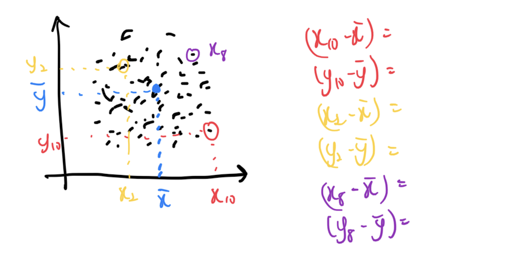

```{r, echo = FALSE, eval = FALSE}
library(renderthis)
to_pdf(from = "lecture10.html",complex_slides = TRUE)
```


```{r xaringanExtra, echo=FALSE}
xaringanExtra::use_xaringan_extra(c("tile_view", "animate_css", "tachyons"))
xaringanExtra::use_panelset()
```

```{r setup, include=FALSE}
knitr::opts_chunk$set(
  comment = "",eval = TRUE,fig.retina = 2, message=F, warning = F, fig.height = 5
)
```

```{r packages, echo=FALSE, message=FALSE, warning=FALSE}
library(dplyr)
library(ggplot2)
library(unvotes)
library(tidyverse)
library(openintro)
```


```{css, echo = FALSE}
.tiny .remark-code { font-size: 60%; }
.small .remark-code { font-size: 80%; }
```


```{r include = FALSE}
loans <- loans_full_schema %>%
  select(loan_amount, interest_rate, term, grade, 
         state, annual_income, homeownership, debt_to_income,
         issue_month)
```

## Reminders

- HW 2 due April 26 12pm.

- HW 3 due May 3 12pm.
  - Please start the homework as soon as possible.
  
- **Midterm 1** (Open book, take home, approximate 2 hours, time limit 5 hours) 
  - **Due April 29 midnight, cover lecture 1-12**
  - **Will not cover the Level 2 part of Homework 3**
  - Preparing guides: Finish Homework 1-3, be familiar to the lecture slides.
  - You can copy any your own codes in homework 1-3 to finish the open book exam.
  
- The PDF version of slides can be found on Canvas. 
  - You can use search on it to find function examples.

---

## Recap

- Describing numerical distributions

  - Histograms
  
  - Measures of central tendency: mean, median, mode

  - Shape: skewness and modality
  
  - Spread: variance and standard deviation, range and interquartile range

  - Boxplots
    - Unusual observations
  
  - Density plot

---
## Today
- Relationships between numerical variables 

  - Scatterplot
  
  - Hex plot

  - Correlation coefficient
  
  - Line graph

- Describing categorical distributions

  - Bar plot

- Relationships between categorical data

  - Contingency tables

???

let's move on to talking about relationships between numerical variables. When we're working with numerical data, we often want to investigate whether there's any relationship between two variables. 

One way to visualize the relationship between two numerical variables is with a scatterplot. 

Another way to visualize numerical data is with a hex plot. Hex plots are a bit less common than scatterplots, but they can be useful when you have a lot of data points and you want to see the overall distribution of those points.

Once we've visualized the relationship between two numerical variables, we might want to quantify that relationship. One way to do this is with the correlation coefficient. The correlation coefficient tells us how strong the relationship is between two variables, and whether it's positive or negative.

Finally, we'll talk about line graphs, which are useful for visualizing changes in a variable over time."

Next, we'll move on to describing categorical data. Categorical data is data that's divided into categories or groups, rather than being measured on a numerical scale. For example, you might have data on people's favorite colors, or on whether they prefer dogs or cats.

One way to visualize categorical data is with a bar plot. Bar plots are simple but effective: they show the frequency of each category as a bar, with the height of the bar corresponding to the number of observations in that category.

Finally, we'll talk about contingency tables. Contingency tables are a way to explore relationships between two categorical variables. For example, you might use a contingency table to see whether there's a relationship between people's favorite color and their gender.

---


```{r include = FALSE}
loans <- loans_full_schema %>%
  select(loan_amount, interest_rate, term, grade, 
         state, annual_income, homeownership, debt_to_income,
         issue_month)
```


## Data: Lending Club

- Lending Club is a platform that allows individuals to lend to other individuals

```{r}
loans <- loans_full_schema %>%
  select(loan_amount, interest_rate, term, grade, 
         state, annual_income, homeownership, debt_to_income,
         issue_month)
glimpse(loans)
```

---
## Relationships between numerical variables

- Paired or bivariate data

  - Scatterplot 

  - Hexplot

  - Correlation
  
  - Line graph 

---

## Scatterplot
* We have seen examples of scatterplots 
  - Our ggplot 2 example, our facet example.
  - Remember how to change the theme?
  
* Each point is a single observation with two characteristics, or variables, plotted on the x- and y-axis respectively 
.tiny[
```{r warning = FALSE, fig.height=4}
ggplot(loans, aes(x = debt_to_income, y = interest_rate)) +
  geom_point()
```
]

???

Scatterplots are a way to visually represent a relationship between two variables. Each point on the plot represents a single observation with two characteristics or variables plotted on the x- and y-axis respectively.

We have seen some examples of scatterplots in previous lectures, for instance, our ggplot 2 example and our facet example. 


Let's take a look at an example scatterplot on this slide, where we are plotting the interest rate against the debt-to-income ratio for Lending Club loans.

A small question, Do you remember how to change the theme? 
---


## Scatterplot in base R
.tiny[
.pull-left[
```{r message = TRUE, out.width = "100%"}
ggplot(loans, aes(x = debt_to_income, y = interest_rate)) +
  geom_point()
```
]

.pull-right[
```{r out.width = "100%"}
plot(loans$debt_to_income, loans$interest_rate)
```
]
]

???

Here we can see a comparison of scatterplots created using ggplot and base R.

Both plots show the same relationship between these two variables, but the ggplot version has more styling options and is generally more customizable.

---

## Overplotting and hex plots

- Overplotting is when points are plotted on top of each other

- Common in large data sets 

- A few ways to deal with this include using `alpha`, or `jitter()`

- Alternatively, hex plots or hexbin plots

.tiny[
.pull-left[
```{r warning = FALSE, out.width = "100%"}
ggplot(loans, aes(x = debt_to_income, 
                  y = interest_rate)) +
  geom_point()
```
]

.pull-right[
```{r warning = FALSE, out.width = "100%"}
ggplot(loans, aes(x = debt_to_income,
                  y = interest_rate)) +
  geom_hex()
```
]
]

???

In large datasets, it is common that points overlap each other, leading to overplotting. In order to deal with this issue, we have some options such as using transparency or the jitter() function. However, an alternative option is the hex plot. NEXT SLIDE

---

## Hex plot

- Hex plots divide the graphing surface into hexagons 

  - All points are grouped into their respective hexagonal regions 
  
  - Color gradient indicates the number of observations (count) in each hexagonal area.

```{r echo = FALSE, warning = FALSE}
ggplot(loans, 
       aes(x = debt_to_income, y = interest_rate)) +
  geom_hex()
```

???

Hex plots are a variation of scatterplots that help to reduce the problem of overplotting, which occurs when points are plotted on top of each other.
A hex plot divides the graphing surface into hexagons, and all points are grouped into their respective hexagonal regions.
The color gradient indicates the number of observations (count) in each hexagonal area.
Hex plots are especially useful for large datasets, where overplotting is a common issue.
In the example shown, the hex plot helps us to visualize the distribution of interest rates and debt-to-income ratios of borrowers in the Lending Club dataset.

---

## Correlation

- Correlation is the association between two variables 

- (Pearson) Correlation coefficient is a measure of **linear** correlation between two sets of data

- Ranges from -1 to 1

```{r echo=FALSE, out.width="70%"}
knitr::include_graphics("img/corr.svg")
```

???

In statistics, correlation is a measure that describes the association between two variables. The Pearson correlation coefficient, which is the most commonly used measure of correlation, quantifies the linear relationship between two sets of data. 

It ranges between -1 and 1, where a correlation of 1 indicates a perfect positive correlation (both variables move in the same direction), a correlation of -1 indicates a perfect negative correlation (both variables move in opposite directions), and a correlation of 0 indicates no linear correlation. In the first row we know how the correlation varies when 2 variables linear relationship varies.

From the plot we can know when two variables have a non-linear relationship, the correlation can be 0. So remember this correlation coefficient is only for linear relationship only.


---
## Correlation

Recall:
- Sample mean: $\bar{x} = \frac{x_1 + x_2 + ... + x_n}{n} = \frac{\sum_{i = 1}^{n} x_i}{n}$
- Sample variance: $s^2 = \frac{(x_1 - \bar{x})^2 + (x_2 - \bar{x})^2 + ... + (x_n - \bar{x})^2}{n - 1} = \frac{\sum_{i=1}^{n} (x_i-\bar{x})^2}{n-1}$

- Population mean: $\mu$
- Population variance: $\sigma^2$

- When talking about a population parameter for a variable $x$, might use subscript $x$, e.g., $\mu_x$, $\sigma^2_x$; similarly for a sample statistic, e.g., $s_x^2$

???
We introduce the use of subscripts to denote which variable we are referring to. For example, we may use $\mu_x$ to denote the population mean of variable $x$, and $s_y^2$ to denote the sample variance of variable $y$.


---
## Correlation
- Sample correlation: $r_{xy} = \frac{\sum_{i=1}^n (x_i-\bar{x})(y_i-\bar{y})}{\sqrt{\sum_{i=1}^n (x_i-\bar{x})^2 \sum_{i=1}^n(y_i-\bar{y})^2}}$

- Population correlation: $\rho$

- To calculate: `cor(vector1, vector2)` in R

???

Here we provide the formula for the sample correlation when we have 2 samples X and Y. Remember this formula requires the X and Y has the same sample size.

The population correlation can be expressed as $\rho$. Remember we want to use the sample correlation to infer the unknown population correlation.

In R, you can calculate the correlation between two vectors using the cor() function.

---
## Correlation
- Sample correlation: $r_{xy} = \frac{\sum_{i=1}^n (x_i-\bar{x})(y_i-\bar{y})}{\sqrt{\sum_{i=1}^n (x_i-\bar{x})^2 \sum_{i=1}^n(y_i-\bar{y})^2}}$

```{r echo=FALSE, out.width="80%"}
knitr::include_graphics("img/corr1.png")
```

???

For each pair of the X_i and Y_i, we calculate the multiplication of the deviance of X_i to X bar and deviance of Y_i to Y bar 

---
## Correlation
- Sample correlation: $r_{xy} = \frac{\sum_{i=1}^n (x_i-\bar{x})(y_i-\bar{y})}{\sqrt{\sum_{i=1}^n (x_i-\bar{x})^2 \sum_{i=1}^n(y_i-\bar{y})^2}}$

```{r echo=FALSE, out.width="80%"}

```
???

Now let's first look at the nominator. For each pair of the X_i and Y_i, we calculate the multiplication of the deviance of X_i to X bar and deviance of Y_i to Y bar 

---
## Correlation
- Sample correlation: $r_{xy} = \frac{\sum_{i=1}^n (x_i-\bar{x})(y_i-\bar{y})}{\sqrt{\sum_{i=1}^n (x_i-\bar{x})^2 \sum_{i=1}^n(y_i-\bar{y})^2}}$

- Nominator "Variance" of X and Y.

```{r echo=FALSE, out.width="80%"}

```

???

For each pair of the X_i and Y_i, we calculate the multiplication of the deviance of X_i to X bar and deviance of Y_i to Y bar, and then sum up all of the multiplied deviance. 

Remember when calculate the variance, we use the deviance of X_i to X bar square? Here we are still at second order, but not squared, as the multiplication of X deviance and Y deviance.

So just like the variance of X, we can think the correlation nominator as a "variance" of X and Y. It's actually related to sample covariance.

---
## Correlation
- Sample correlation: $r_{xy} = \frac{\sum_{i=1}^n (x_i-\bar{x})(y_i-\bar{y})}{\sqrt{\sum_{i=1}^n (x_i-\bar{x})^2 \sum_{i=1}^n(y_i-\bar{y})^2}}$

- Nominator "Variance" of X and Y.

- What does the denominator look like? 

--
  - Recall: Sample variance $s^2 = \frac{(x_1 - \bar{x})^2 + (x_2 - \bar{x})^2 + ... + (x_n - \bar{x})^2}{n - 1} = \frac{\sum_{i=1}^{n} (x_i-\bar{x})^2}{n-1}$
  
  - Denominator: $\sqrt{\sum_{i=1}^n (x_i-\bar{x})^2 \sum_{i=1}^n(y_i-\bar{y})^2} = \sqrt{(n-1)s_x^2 (n - 1)s_y^2} = (n-1)s_xs_y$

- Pearson correlation coefficient is scale and location-invariant
  
  - You can think of the denominator as a scaling factor 
  
  - Subtract sample means, $\bar{x}$ and $\bar{y}$ does not change it

???

Now let's look at the denominator. What does the denominator look like? 

Recall: Sample variance looks like this, so we can find the denominator is actually (n-1) * standard deviation X multiplied standard deviation Y.

The Pearson correlation coefficient is a measure of linear association between two variables, which is scale and location-invariant. 

This means that the correlation coefficient is not affected by differences in the measurement scales or by changes in the origin of the coordinate system. The denominator in the formula for the correlation coefficient can be thought of as a scaling factor that normalizes the variables. We can subtract the sample means, $\bar{x}$ and $\bar{y}$, from the variables to center them around zero, which will not change the correlation coefficient.

---

- Pearson correlation coefficient is scale and location-invariant
  
  - You can think of the denominator as a scaling factor 
  
  - Subtract sample means, $\bar{x}$ and $\bar{y}$ does not change it
  
```{r}
x = c(1,2,3,4,5)
y = c(2,2,1,4,5)
cor(x,y)
cor(x-mean(x), y-mean(y))
cor(x/2, y/2)
```

???

Here are some example in R to show you that the change of scale and location will not affect the sample correlation.

---

## Guess the correlation

http://guessthecorrelation.com/

```{r echo=FALSE, out.width="80%"}
knitr::include_graphics("img/corrGame.png")
```

???

In this website you can try to guess the correlation of the scatter plot. You can try it yourself.

---

## Line graphs: Observation against time

Line graphs are most commonly used for data over time, *time series data*

.tiny[
.panelset[
.panel[.panel-name[Plot]
```{r ref.label = "line", echo = FALSE, warning = FALSE}
```
]
.panel[.panel-name[Code]
```{r line, fig.show = "hide", warning = FALSE}
loans %>%
  group_by(issue_month) %>%
  summarize(count = n()) %>%
  ggplot(aes(x = as.Date(paste0("01-", issue_month), format = "%d-%b-%Y"), y = count)) +
  geom_point() + 
  geom_line() +
  scale_x_date(labels = scales::date_format(format = "%m/%Y"), 
               breaks = scales::date_breaks(width = "1 month"), 
               expand = c(.02, .02)) +
  labs(title = "Number of monthly loans", 
    y = "Number of loans",
    x = "Month")
```
]
]
]

???

We use line graphs to visualize data over time, which is also known as time-series data. In this example, we're looking at the number of loans issued each month. 

You can see that the graph shows the fluctuations over time, with some months having a higher number of loans issued than others. We can use the as.Date() function to convert the issue_month column to a date format, which allows us to create a line graph over time. We can also add points to the graph to highlight the data points.

---
## Line graphs
- Be careful of `geom_path()` vs. `geom_line()`: 

  - `geom_path()` connects the observations in the order in which they appear in the data
  
  - `geom_line()` connects them in order of the variable on the x axis.

- In base R: `plot(x, y, type = "l")`. Also see `lines()`

???

When creating a line graph in ggplot2, be careful of geom_path() vs. geom_line(). geom_path() connects the observations in the order in which they appear in the data, while geom_line() connects them in order of the variable on the x-axis. In base R, you can create a line graph using the plot(x, y, type = "l") function. You can also use the lines() function to add lines to an existing plot.

---
## Line graphs in base R
.tiny[
.panelset[
.panel[.panel-name[Plot]
```{r ref.label = "line-base", echo = FALSE, warning = FALSE}
```
]
.panel[.panel-name[Code]
```{r line-base, fig.show = "hide", warning = FALSE}
tmpDF <- loans %>%
  group_by(issue_month) %>%
  summarize(count = n()) %>%
  mutate(issue_month = as.Date(paste0("01-", issue_month), format = "%d-%b-%Y")) %>%
  arrange(issue_month)
plot(tmpDF$issue_month, tmpDF$count, type = "l",
     main = "Number of monthly loans",
     xlab = "Month",
     ylab = "Number of loans")
```
]
]
]

???

In this slide, we are showing a line graph using the base R graphics system. The code is similar to the previous ggplot example. We plot the data using the plot() function with the type argument set to "l" to create a line graph. We also set the title and axis labels using the main argument and the xlab and ylab arguments, respectively.

---

## Describing categorical data 

- Describing categorical distributions

  - Bar plot

- Relationships between categorical data

  - Contingency tables
  
  - Stacked bar plot (Next lecture)

???

You can describe categorical data using different types of plots. A common way to represent categorical data is with a bar plot. A bar plot displays the frequency or proportion of each category as bars with heights proportional to the values that they represent.

Another way to explore relationships between categorical variables is to use contingency tables. Contingency tables show the frequency distribution of two or more variables. They help to understand the association between variables by showing the distribution of one variable for each category of the other variable.

---

## Bar plot: category counts

A bar plot is common way to display a single categorical variable.

.tiny[
.pull-left[
```{r message = TRUE, out.width = "100%"}
ggplot(loans, aes(x = homeownership)) +
  geom_bar()
```
]

.pull-right[
```{r out.width = "100%"}
barplot(table(loans$homeownership)
        [table(loans$homeownership) > 0])
```
]
]

???

A bar plot is common way to display a single categorical variable.

On the left side, we have an example of a bar plot using the ggplot2 package in R for the home ownership variable in the loans data set.

On the right side, we have an example of a bar plot in base R for the same variable. 

In both plots, each bar represents a category and its height represents the count or frequency of observations in that category. 

---
## Bar plot with proportions

.tiny[
.pull-left[
```{r message = TRUE, out.width = "100%"}
ggplot(loans, aes(x = homeownership)) +
  geom_bar()
```
]

.pull-right[
```{r out.width = "100%"}
ggplot(loans, aes(x = homeownership)) +
  geom_bar(aes(y = ..count../sum(..count..)))
```
]
]


`..count..` is an internal variable that ggplot creates to store the count values (https://stackoverflow.com/questions/36604127/creating-a-bar-plot-with-proportions-on-ggplot)

???

On the left side, we have a bar plot that displays the count of each category of the homeownership variable. 

On the right side, we have a similar bar plot, but instead of showing the counts, we show the proportions or percentages of each category. 

The ..count.. variable is an internal variable created by ggplot that stores the count values of each category. We use it to calculate the proportions by dividing it by the sum of all the counts.

---

## Adding the count numbers to the barplot

```{r, fig.height=4}
# Below the top
ggplot(data = diamonds, mapping = aes(x = cut)) +
  geom_bar() +
  geom_text(aes(label = ..count..), stat = "count", vjust = 1.5, colour = "white") #<<
```

Changing the vjust to a negative value will make the number on the top of the bars.

???
In this example, we are using the diamonds dataset, and we want to create a barplot of the cut variable. We start by creating the basic barplot using geom_bar(). Then we use the geom_text() function to add the count numbers to the bars. We specify the label aesthetic to be ..count.. and use the stat = "count" argument to tell ggplot2 to count the number of observations in each group. Finally, we adjust the vertical justification of the text using the vjust argument. In this case, we set it to 1.5 to place the text just above the top of the bars.

---
## Contingency tables
A contingency table summarizes data for two categorical variables

```{r}
xtabs(~ homeownership + grade, data = loans_full_schema)
```

Each value in the table represents the number of times a particular combination of variable outcomes occurred, in other words the **frequency distribution** of the variables

???

You can use a contingency table to summarize data for two categorical variables. The resulting table provides the frequency distribution of each possible combination of variable outcomes. Here is an example of creating a contingency table in R using the xtabs() function. This table shows the distribution of the homeownership and grade variables in the loans_full_schema dataset. Each cell in the table shows the count of observations that fall into a particular combination of variable outcomes.

---
## Contingency tables
```{r}
xtabs(~ homeownership + grade, data = loans_full_schema)
```

- An additional row for column totals is often included
- Similarly, an additional column for row totals
- How do we code this in R?

???

But often, we also want to include row and column totals.

---
## Contingency tables with row and column totals
```{r}
outTable <- xtabs(~ homeownership + grade, data = loans_full_schema)
outTableTotals <- outTable %>%
  cbind(rowTotal = rowSums(outTable)) 
outTableTotals <- outTableTotals %>%
  rbind(columnTotal = colSums(outTableTotals))
outTableTotals
```
???

But often, we also want to include row and column totals. To do this, we can use the rowSums() and colSums() functions to compute the totals, and then combine these with the original table using cbind() and rbind().

The resulting table shows the frequency distribution of the two variables, as well as the row and column totals.

---
## Contingency tables with proportions
- Sometimes, proportions might be more useful than totals

- Row proportions are the proportion out of **row totals**

- Column proportions are the proportion out of **column totals**

- How do we code **row proportions** in R?

- How about **column proportions**?

---
## Summary

--
- Relationships between numerical variables 

  - Scatterplot
  
  - Hex plot

  - Correlation coefficient
  
  - Line graph

- Describing categorical distributions

  - Bar plot

- Relationships between categorical data

  - Contingency tables
  