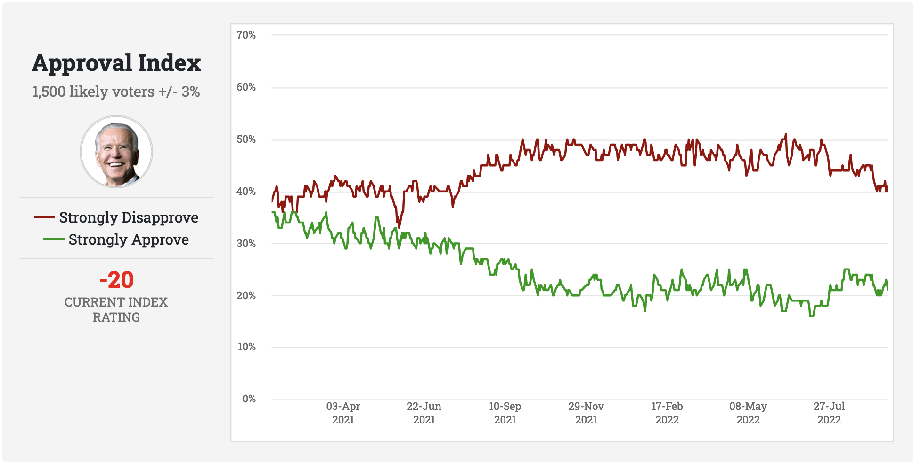

```{r, echo = FALSE, eval = FALSE}
library(renderthis)
to_pdf(from = "lecture12.html",complex_slides = TRUE)
```


```{r xaringanExtra, echo=FALSE}
xaringanExtra::use_xaringan_extra(c("tile_view", "animate_css", "tachyons"))
xaringanExtra::use_panelset()
```

```{r setup, include=FALSE}
knitr::opts_chunk$set(
  comment = "",eval = TRUE,fig.retina = 2, message=F, warning = F, fig.height = 4.5
)
```

```{r packages, echo=FALSE, message=FALSE, warning=FALSE}
library(dplyr)
library(ggplot2)
library(unvotes)
library(tidyverse)
library(openintro)
```


```{css, echo = FALSE}
.tiny .remark-code { font-size: 60%; }
.small .remark-code { font-size: 80%; }
```


```{r include = FALSE}
loans <- loans_full_schema %>%
  select(loan_amount, interest_rate, term, grade, 
         state, annual_income, homeownership, debt_to_income,
         issue_month)
```

## Reminders

- HW 3 due May 3 12pm.
  - Please start the homework as soon as possible.
  
- **Midterm 1** (Open book, take home, approximate 2 hours, time limit 5 hours) 
  - **Due April 29 midnight, cover lecture 1-12**
  - Preparing guides: Finish Homework 1-3, be familiar to the lecture slides.
  - You can copy any your own codes in homework 1-3 to finish the open book exam.
  
- The PDF version of slides can be found on Canvas. 
  - You can use search on it to find function examples.

---

## Today

- Statistical inference and probability theory

- Introduction to probability 

---

## Statistics definition

> A statistic or *sample statistic* is any quantity computed from values in a sample which is considered for a statistical purpose.

* Recall: Population vs. sample 
  - A **sample** is a portion or **subset** of the larger **population**

  - **Population**: the entire group we would like to make conclusions about 

  - **Sample**: specific group we have collected data from 

  - Population **parameter**, e.g., population mean
    - This is a fixed quantity

  - Sample **statistic**, e.g., sample mean
    - depends on sample selected.
  
> Specifically, statistic is a **function** of a sample.

---

## Statistic inference background setting (formal definition)

.panelset[
.panel[.panel-name[Overview]
* Population follows some **statistical model**: e.g: normal distribution.
   - This is called **population distribution**.
   - This is an assumption!

* Population parameter is the population distribution parameter. e.g: $\mu$ and $\sigma$ of normal distribution.

* Sample are random variables drawn from the population distribution

* Statistics are functions of a sample.
  - e.g: Sample mean, sample variance.
]
.panel[.panel-name[Population distribution]

> Any statistical inference requires some assumptions. The population is something we don't know and wants to infer,

* We need assumptions about population distribution: **population distribution**
  - We pick a statistic model, and assume the population follows that model (distribution)
  - The population distribution will have (population) parameters. *Assumed* **Unknown!**
  - We will cover those distribution details later.
| **Population** | **Model** | **Parameters**| **Math form**|
|:------:|:------:|
| Student heights | Normal distribution |$\mu, \sigma$ | $N(\mu, \sigma)$ |
| Heads in **fixed** $n$ coin toss | Binomial distribution |$p$ (Is $n$ a parameter?) | $Binomial(n, p)$ |
| Waiting time of a service center | Exponential distribution |$\theta$ | $exponential(\theta)$ |

* What happens if we use a wrong population distribution?

]
.panel[.panel-name[Sample, statistics]

* Samples are random variables (RVs) drawn from the population model.

* Sample size is how many samples you get from the population

* Statistics is a function of the sample.


]
.panel[.panel-name[Quiz]

]


---

## Statistical Inference

- **Statistical inference** allows us to draw conclusions about the larger population. It is the process of using sample data to make conclusions about the underlying population the sample came from.

.pull-left[
```{r echo=FALSE, out.width="70%"}
knitr::include_graphics("img/soup.png")
```
]

.pull-right[
Similar to tasting a spoonful of soup while cooking to make an inference about the entire pot.
]

- This is one goal of statistics: to answer a question, by making **inferences** about a **population** based on data in one or more **samples**.

- The validity of our inferences depends on a variety of factors, including the **representativeness** of the sample

---

## Statistical inference

When a sample statistic is used to estimate a population parameter, it will be accompanied by a margin of error

```{r echo = FALSE, out.width = "85%"}

```

.tiny[
Source: https://www.rasmussenreports.com/public_content/politics/biden_administration/prez_track_sep23
]
---
## Statistical inference

- In order to draw principled conclusions from our data, we rely on a formal probabilistic framework that allows us to **quantify uncertainty**.

- **Statistical inference** is built upon the foundation of **probability theory**.

- Many topics in statistical inference

  - Fundamentals: probability, distributions, random variables, ...
  
  - Sampling 
  
  - Hypothesis testing
  
  - Point estimates and confidence intervals
  
  - Modeling: Linear regression, analysis of variance, nonparametric models, machine learning, ... 


---


---


