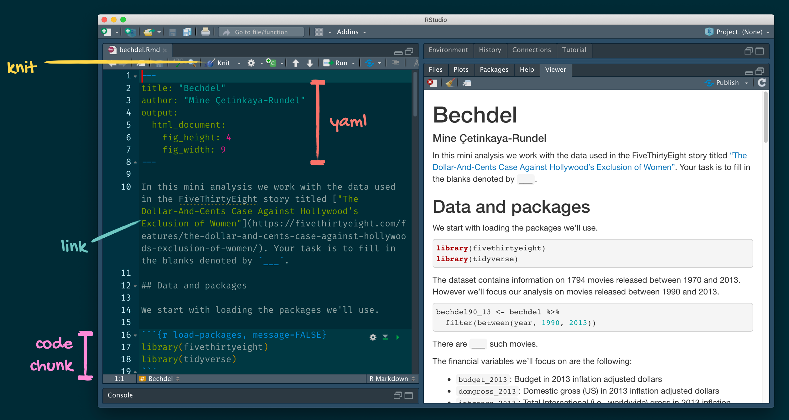

```{r, eval = FALSE, echo = FALSE}
library(renderthis)
to_pdf(from = "lecture2.Rmd",complex_slides = TRUE)
```


```{css, echo = FALSE}
.small .remark-code { font-size: 80%; }
```

```{r xaringanExtra, echo=FALSE}
xaringanExtra::use_xaringan_extra(c("tile_view", "animate_css", "tachyons"))
xaringanExtra::use_panelset()
```

```{r setup, include=FALSE}
knitr::opts_chunk$set(
  comment = "",eval = TRUE,fig.retina = 2, message=F, warning = F
)
```

```{r packages, echo=FALSE, message=FALSE, warning=FALSE}
library(dplyr)
library(ggplot2)
library(unvotes)
```


## Recap

--
.pull-left[
```{r echo=FALSE, out.width="25%"}
knitr::include_graphics("img/r-logo.png")
```
- R is a free, open-source statistical programming language

- R is also an environment for statistical computing and graphics

- It is easily extensible with packages
]
.pull-right[
```{r echo=FALSE, out.width="50%"}
knitr::include_graphics("img/rstudio-logo.png")
```
- RStudio is a convenient interface for R called an **IDE** (integrated development environment)

- RStudio is not a requirement for programming with R, but it's very commonly used by R programmers and data scientists

]

???

Last lecture we Introduced R, R studio, and how to install the R and R studio. While RStudio is not strictly necessary for programming with R, it is a widely used and highly regarded tool for R programmers and data scientists. By understanding these key points, you can start to develop a solid foundation for working with R programming and data science. 

---
## R Markdown

```{r echo=FALSE, out.width="90%"}

```

Hopefully you would have made your first R Markdown document. In this quarter all homework will be done with R markdown.

* Recap how to knit, how to create a code chunk.


???

Last lecture we also went over the basics of R markdown. Hopefully you would have made your first R Markdown document. In this quarter all homework will be done with R markdown.

---

## Today

- Data types

- Operators

- Vectors

- objects and environment

---

## Data types

- **Logical/Booleans**: binary values: `TRUE` or `FALSE` in R

- **Integers**: whole numbers (positive, negative or zero)

- **Double**: a floating point number, like $1.87 \times {10}^{6}$

- **Characters**: e.g., letters; R displays it using double quotes. **strings** = sequences of characters

- **Complex**: complex numbers, e.g., 1 + 2i (rarely used in data analysis)

- **Dates**: Time objects (We will cover it later)

--
### Note: 
- each of these data types can have missing or ill-defined values: NA, NaN, etc.
- Integers and doubles are both *numeric*

???

In R programming, there are several data types that are commonly used when working with data.

First, there are logical or Boolean values, which are binary values that can be either TRUE or FALSE. These values are often used in conditional statements and comparisons.

Second, there are integers, which are whole numbers that can be positive, negative, or zero. These values are commonly used in counting and other mathematical operations.

Third, there are doubles, which are floating point numbers that can have decimal places. These values are used to represent numbers that are not whole numbers, such as 1.87 x 10^6.

Fourth, there are characters, which are individual letters or other symbols. In R programming, characters are typically displayed using double quotes. A sequence of characters is called a string.

Fifth, there are complex numbers, which are numbers with both a real and imaginary component. These values are rarely used in data analysis.

Finally, there are dates, which are used to represent dates and times in R programming. We will cover it in later lectures.

---
## Functions related to data types

`typeof()` function returns the type

`is.`_foo_`()` functions return Booleans (TRUE or FALSE) for whether the argument is of type _foo_

`as.`_foo_`()` (tries to) "cast" its argument to type _foo_ --- to translate it sensibly into a _foo_-type value

`is.na()` checks if the value is NA

```{r}
typeof(7)
is.numeric(7)
```

???

In R programming, there are several functions that can be used to determine the type of a variable or data object.

The typeof() function can be used to return the type of a variable or data object. For example, typeof(7) will return "double", indicating that the value 7 is a double data type.

The is.foo() functions can be used to return a Boolean value indicating whether an argument is of a certain data type. For example, is.numeric(7) will return TRUE, indicating that the value 7 is of the numeric data type.

The as.foo() functions can be used to attempt to "cast" an argument into a specific data type. For example, as.numeric("7") will return 7, as it attempts to translate the character string "7" into a numeric data type.

Finally, the is.na() function can be used to check if a value is NA, which stands for "not available" or "missing". This can be useful when working with data that may contain missing values, which need to be handled carefully in data analysis. For example, is.na(NA) will return TRUE, indicating that the value is NA.

---
## Functions related to data types

```{r eval = FALSE}
is.character(7)
is.character("7")
is.character("seven")
is.na("na")
is.na(NA)
```

---
## Functions related to data types

```{r}
is.character(7)
is.character("7")
is.character("seven")
is.na("7")
```

---
## Functions related to data types

```{r eval = FALSE}
as.character(5/6)
as.numeric(as.character(5/6))
6*as.numeric(as.character(5/6))
```

---
## Functions related to data types

```{r}
as.character(5/6)
```

```{r eval = FALSE}
as.numeric(as.character(5/6))
6*as.numeric(as.character(5/6))
```

---
## Functions related to data types

```{r}
as.character(5/6)
as.numeric(as.character(5/6))
```

```{r eval = FALSE}
6*as.numeric(as.character(5/6))
```
---
## Functions related to data types

```{r}
as.character(5/6)
as.numeric(as.character(5/6))
6*as.numeric(as.character(5/6))
```


> Small summary: any numbers are numeric, anything inside qoute signs "" are string.

---

## Operators

- **Unary** operators take a single input, e.g., `-` for arithmetic negation, `!` for Boolean
- **Binary** operators take two inputs and give a output, e.g., usual arithmetic operators, modulo 
- See https://stat.ethz.ch/R-manual/R-devel/library/base/html/Arithmetic.html for more details

```{r}
7 + 5
7 - 5
7*5
```

???

The above code demonstrates the use of arithmetic operators in R.

The first code chunk shows examples of binary operators (+, -, *) with two operands each:

---
```{r}
7^5
7/5
7 %% 5
7 %/% 5
```

These operators represent exponentiation (^), division (/), modulus (%%), and integer division (%/%).

???

The second code chunk shows additional arithmetic operators (^, /, %%, %/%) that are also binary operators:

These operators represent exponentiation (^), division (/), modulus (%%), and integer division (%/%).

---
## Arithmetic Operators vs. Logical Operators

- Operators on previous slides were arithmetic operators

- **Logical operators** are **comparisons** (also binary operators; they take two objects, like numbers, and give a Boolean)
```{r}
7 > 5
7 < 5
7 >= 7
```

???

Arithmetic operators are used to perform mathematical operations on numerical values, such as addition (+), subtraction (-), multiplication (*), and division (/). They operate on numeric values and return numeric results.

Logical operators, on the other hand, are used to compare values and return a logical result (TRUE or FALSE). Examples of logical operators include >, <, >=, <=, ==, and !=.

The slide demonstrates examples of logical operators, using the comparison between 7 and 5. The first comparison 7 > 5 is TRUE, since 7 is greater than 5. The second comparison 7 < 5 is FALSE, since 7 is not less than 5. The third comparison 7 >= 7 is TRUE, since 7 is greater than or equal to 7.

---

Additional comparisons:

```{r}
7 <= 5
7 == 5
7 != 5
```

- "and" and "or" are also logical operators
```{r eval=FALSE}
(5 > 7) & (6*7 == 42)
(5 > 7) | (6*7 == 42)
```
<small>(what should these give?)</small>

???

The additional comparisons on this slide include <= (less than or equal to), == (equal to), and != (not equal to), in addition to the comparisons shown on the previous slide. 

---

- "and" and "or" are also logical operators
```{r }
(5 > 7) & (6*7 == 42)
(5 > 7) | (6*7 == 42)
```

The & operator returns TRUE if both sides of the operator are true, and the | operator returns TRUE if at least one side of the operator is true.

???

The additional comparisons on this slide include <= (less than or equal to), == (equal to), and != (not equal to), in addition to the comparisons shown on the previous slide. 

The & operator returns TRUE if both sides of the operator are true, and the | operator returns TRUE if at least one side of the operator is true.

---

## Assignment operators: Data can have names

We can give names to data objects; these give us **variables**

A few variables are built in:
```{r}
pi
letters
```

Variables can be arguments to functions or operators, just like constants:
```{r}
pi*10
```

???

n R, we can assign a name to a data object, which we call a variable.
Some variables are already built in and can be used without assigning a value to them, like pi or letters.
Variables can be used in expressions and functions, just like constants, e.g., pi * 10.

---

Most variables are created with the **assignment operator**, `<-` or `=`  

The value of a variable can be retrieved by typing its name, e.g., myVar.

```{r}
myVar <- 100
myVar
myVar2 <- 10
myVar*myVar2
```


???

In R, most variables are created with the assignment operator, <- or =.
The value to the right of the operator is assigned to the variable on the left, e.g., myVar <- 100.
The value of a variable can be retrieved by typing its name, e.g., myVar.

---
The assignment operator also changes values:
```{r}
myVar3 <- myVar*myVar2
myVar3
myVar3 <- 30
myVar3
```

???

The assignment operator <- or = is also used to change the value of a variable. For example, in the code above, we first assign 100 to myVar and 10 to myVar2. We then use these variables to compute the value of myVar3 and assign the result to this variable. Later on, we change the value of myVar3 to 30 by assigning it a new value using the assignment operator.

--

Using names and variables makes code easier to design, easier to debug, less prone to bugs, easier to improve, and easier for others to read

Avoid "magic constants" (using numbers directly in source code); use named variables

---

## Example: The root formula

Suppose a high school student asks us for help solving several quadratic equations of the form $ax^2+bx+c = 0$. The quadratic formula gives us the solutions:

$$
\frac{-b - \sqrt{b^2 - 4ac}}{2a}\,\, \text{ and } \frac{-b + \sqrt{b^2 - 4ac}}{2a}
$$

In R we can **define** variables and write expressions with these variables, similar to how we do so in math, and obtain a numeric solution.

```{r}
a = 1
b = 1
c <- -1
```

---

```{r}
a = 1
b = 1
c <- -1
```

Now these values are saved in variables, to obtain a solution to our equation, we use the quadratic formula:  

```{r}
(-b + sqrt(b^2 - 4*a*c) ) / ( 2*a )
(-b - sqrt(b^2 - 4*a*c) ) / ( 2*a )
```

---

# The workspace

We use the term _object_ to describe stuff that is stored in R. Variables are examples, but objects can also be more complicated entities such as functions, datasets, which are described later.

As we define objects in the console, we are actually changing the _workspace_.

In RStudio, the _Environment_ tab shows the objects in the workspace:


---
# object not found

In the environment, we should see  `a`, `b`, and `c`. If you try to recover the value of a variable that is not in your workspace, you receive an error. 

For example, if you type `x` you will receive the following message: 

````
> x
Error: object 'x' not found
````

This error tells you that you asked the R to tell you something it doesn't know! (Because you haven't defined yet)

This is the **most common** error for beginners. A typo of object name can lead to this.

---

## Aside: R markdown
The environment of your R Markdown document is separate from the Console!

.pull-left[
First, run the following in the console

.small[
```{r eval = FALSE}
x <- 2
x * 3
```
]
]

--

.pull-right[
Then, add the following in an R chunk in your R Markdown document and try to knit it.

.small[
```{r eval = FALSE}
x * 3
```
]

.question[
What happens? Why the error?
]
]

???

When adding the x * 3 command to an R chunk in the R Markdown document, an error will occur because the variable x was not defined within the R markdown environment. The R Markdown environment is separate from the console environment, so any variables created or functions defined in the console will not carry over to the R Markdown document unless they are specifically included or imported.

---

### Explanation:

> When adding the `x * 3` command to an R chunk in the R Markdown document, an error will occur because the variable x was not defined within the R markdown environment. The R Markdown environment is separate from the console environment, so any variables created or functions defined in the console will **not carry over to the R Markdown document** unless they are specifically included or imported.

---


## First data structure: vectors

Group related data values into one object, a **data structure**

A **vector** is a sequence of values, *all of the same type*
<small>(what are data types?)</small>

```{r}
x <- c(7, 8, 10, 45)
x
is.vector(x)
```

> `c()` function creates a vector containing all its arguments in order, c stands for _concatenate_:

???

In R, we can group related data values into one object using data structures. 

One such structure is a vector, which is a sequence of values that are all of the same data type.

For example, we can create a vector x containing four numeric values using the c() function.

We can then output x to the console and check if it is a vector using the is.vector() function.

---
## Subsetting

`x[1]` is the first element, `x[4]` is the 4th element  
`x[-4]` is a vector containing **all but** the fourth element

Vector of indices:
```{r}
x
x[c(2, 4)]
```

Vector of negative indices
```{r}
x[c(-1, -3)]
```
<small>(why that, and not  `8 10`?)</small>


???

To access specific elements of a vector in R, we can use square brackets and the index number of the element we want to access.

For example, x[1] would give us the first element in the vector x. 

We can also use negative indices to exclude certain elements. For instance, x[-4] would give us a vector containing all elements of x except the fourth element.

We can even access a subset of a vector by specifying a vector of indices in square brackets.

For example, x[c(2, 4)] would give us the second and fourth elements of the vector x.

Finally, we can also use negative indices in a vector of indices to exclude certain elements. 

For instance, x[c(-1, -3)] would give us the second and fourth elements of the vector x, since the first and third elements are excluded.

---
## length

To get the length of the vector, use `length()`
```{r}
length(x)
```

???

We can get the length of a vector using length().

---
## Creating vectors

In addition to `c()` function, the function `vector(length = 7)` returns an empty vector of length 7; helpful for filling things up later

```{r}
weeklyHours <- vector(length = 7)
weeklyHours[5] <- 8
weeklyHours
```

The colon operator produces a sequence

```{r}
mySeq <- 2:5
mySeq
```

The sequences defined above are particularly useful if we want to access, say, the first two elements:

```{r}
x[1:2]
```

???

In addition to creating vectors using c(), you can create empty vectors of a specific length using the vector() function.

This can be useful for filling the vector with data later. 

The colon operator : can be used to produce a sequence of integers. For example, 2:5 will create a vector with elements 2, 3, 4, and 5.

The sequences defined above are particularly useful if we want to access, say, the first two elements:

---
## Creating vectors
Many other ways to produce sequences, e.g., 
```{r}
(mySeq <- seq(from = 1, to = 10, by = 2))
```

seq() function takes three arguments: from, to and by (optional).

from and to are the first and last numbers in the sequence, and by specifies the increment between numbers in the sequence.

(Enclosing an assignment statement in parentheses prints the result)


???

seq() function is another way of creating a sequence of numbers with specified arguments.
It takes three arguments: from, to and by (optional).
from and to are the first and last numbers in the sequence, and by specifies the increment between numbers in the sequence.

Enclosing an assignment statement in parentheses prints the result.

---

## Vector can have names for each element

Remember can create vectors using the function `c`, which stands for _concatenate_:

```{r}
codes <- c(380, 124, 818)
```

We can also create character vectors. We use the quotes to denote that the entries are characters rather than variable names.

```{r}
country <- c("italy", "canada", "egypt")
```

In R you can also use single quotes:

```{r}
country <- c('italy', 'canada', 'egypt')
```

---

## Vector can have names for each element

By now you should know that if you type:
```{r, eval=FALSE}
country <- c(italy, canada, egypt)
```

you receive an error because the variables `italy`, `canada`, and `egypt` are not defined. If we do not use the quotes, R looks for variables with those names and returns an error.

We can also assign names using the `names` functions:

```{r}
codes <- c(380, 124, 818)
country <- c("italy","canada","egypt")
names(codes) <- country
codes
```

---

## Vector can subset by names

If the elements have names, we can also access the entries using these names. Below are two examples.

```{r}
codes["canada"]
codes[c("egypt","italy")]
```

It is the same as we subset by index.

```{r}
codes[c(3,1)]
```

---

## Vectors with additional attributes: Factors
- Factors are built on top of integer vectors

- These have a fixed and known set of possible values. 

- Factors have two components: level numbers (integers) and level labels (characters) 

```{r}
tmp <- factor(c("BS", "MS", "PhD", "MS"))
tmp
as.integer(tmp)
```

> In summary, factors are a useful data type in R for representing categorical data with a fixed and known set of possible values.

???

In addition to regular numeric and character vectors, R also has a special type of vector called factors. Factors are built on top of integer vectors and are used to represent categorical data.

One key feature of factors is that they have a fixed and known set of possible values, which are known as levels. The levels of a factor are stored as integers and their corresponding labels are stored as characters.

In the example code shown on the slide, we create a factor called tmp using the factor() function. The c() function is used to specify the values of the factor. We can see that the levels of the factor are automatically assigned integer values based on the order in which they appear. In this case, "BS" is assigned level 1, "MS" is assigned level 2, and "PhD" is assigned level 3.

To view the integer values of the levels, we can use the as.integer() function to convert the factor to an integer vector.

In summary, factors are a useful data type in R for representing categorical data with a fixed and known set of possible values.

---

## Vectors with additional attributes: Dates

- Dates and date-times are built on top of numeric vectors

- Dates are represented internally as the number of days since the origin, 1 Jan 1970

```{r}
z <- as.Date("2020-01-01")
z
typeof(z)
str(z)
```

---

## Vectors with additional attributes: Dates

- Dates and date-times are built on top of numeric vectors

- Dates are represented internally as the number of days since the origin, 1 Jan 1970

```{r}
z <- as.Date("2020-01-01")
z
typeof(z)
str(z)
```


???

Another type of vector in R with additional attributes is the date vector. Dates and date-times are built on top of numeric vectors and are represented internally as the number of days since the origin, which is January 1st, 1970.

In the example code shown on the slide, we create a date vector called z using the as.Date() function. We specify the date "2020-01-01" as a character string, and R automatically recognizes it as a date and creates a date object. We can see that the output of z shows the date in the standard date format.

To check the data type of the date vector, we use the typeof() function, which returns "double" because dates are stored as the number of days since the origin, which is a numeric value.

Finally, we use the str() function to examine the structure of the date vector. The output shows that the date vector is of type "Date" and is stored as a numeric value representing the number of days since the origin.


---

## Vectors with additional attributes: Dates

```{r}
z
as.integer(z)
as.integer(z) / 365 # roughly 50 yrs
```

> In summary, date vectors are useful for representing dates in R, and they are stored as numeric values representing the number of days since the origin.

We will talk more about packages later on in the class, but the `lubridate` package is particularly useful for dealing with dates. 


---

## Summary

--

- We write programs by composing functions to manipulate data

- The basic data types represent Booleans, numbers, and characters

- Data structures group related values together

- Vectors group values of the same type

- Vector creating and subsetting

---

## Reading:

- R for Data Science Chapter 4, 20
- Additional reading: Matloff Chapter 2
- [Chapter 2:R basics](http://rafalab.dfci.harvard.edu/dsbook/r-basics.html)
