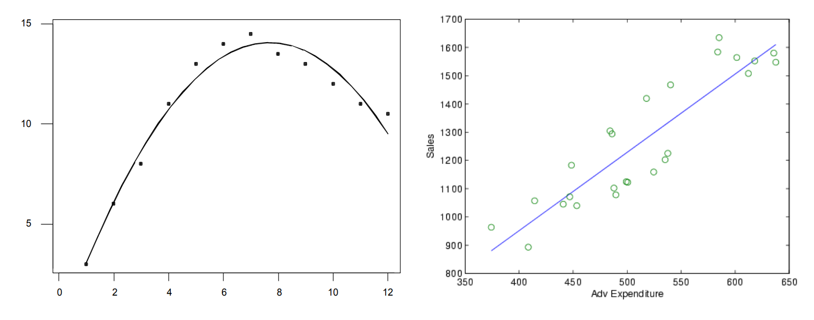
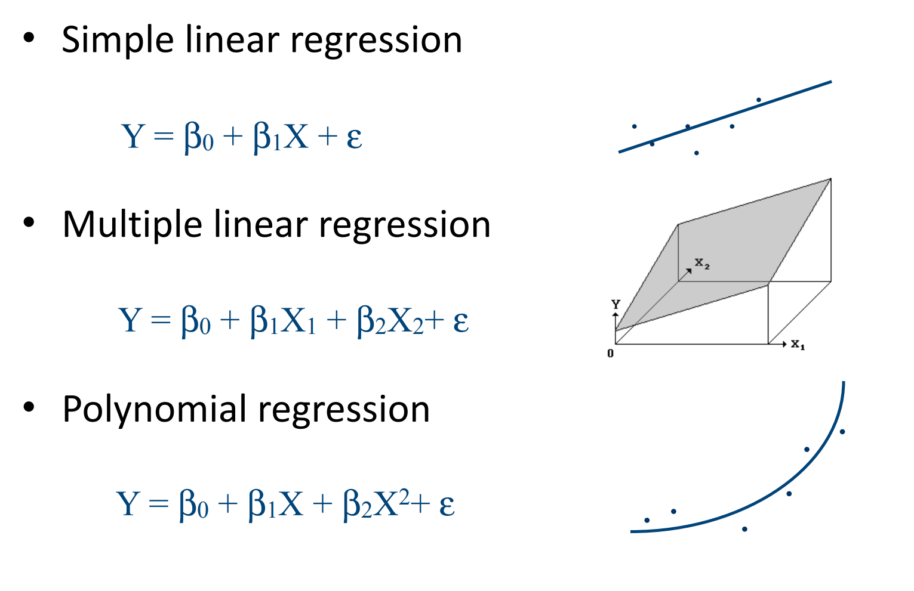
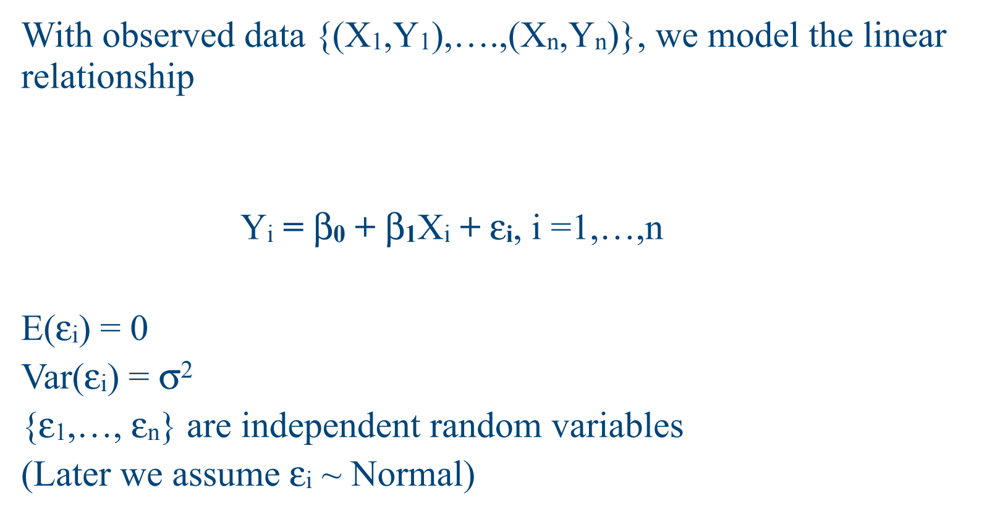
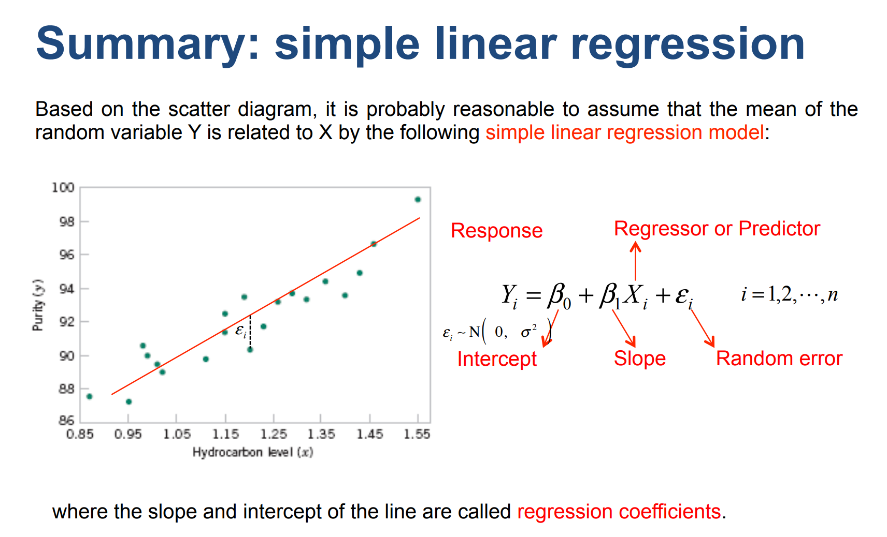
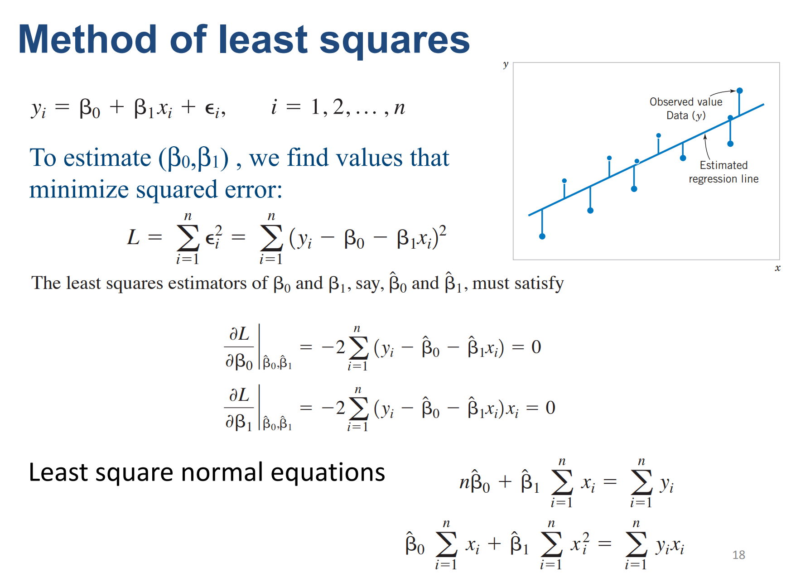
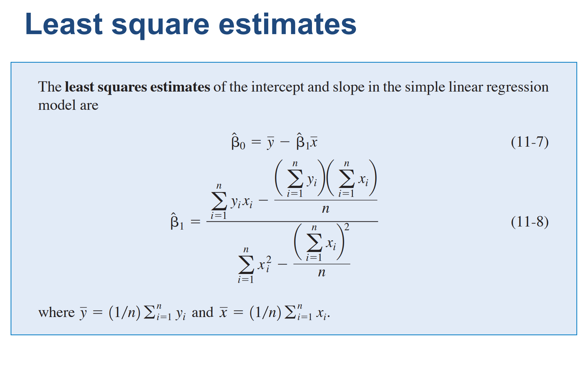
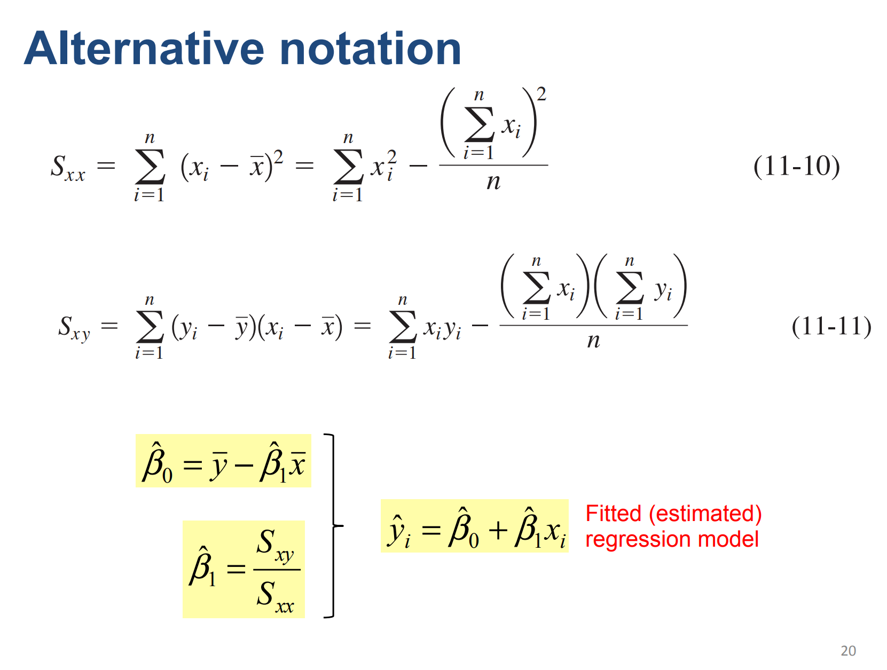

```{r, echo = FALSE, eval = FALSE}
library(renderthis)
to_pdf(from = "lecture24.html",complex_slides = TRUE)
```


```{r xaringanExtra, echo=FALSE}
xaringanExtra::use_xaringan_extra(c("tile_view", "animate_css", "tachyons"))
xaringanExtra::use_panelset()
```

```{r setup, include=FALSE}
knitr::opts_chunk$set(
  comment = "",eval = TRUE,fig.retina = 2, message=F, warning = F, fig.height = 4.5
)
```

```{r packages, echo=FALSE, message=FALSE, warning=FALSE}
library(dplyr)
library(ggplot2)
library(unvotes)
library(tidyverse)
library(openintro)
```


```{css, echo = FALSE}
.tiny .remark-code { font-size: 60%; }
.small .remark-code { font-size: 80%; }
```

## Recap

Last lecture we covered how the linear regression was invented.

Today we will go over the mathematics form of regression and it's derivation.

---

## Basics of Regression

* We observe a **response** or **dependent variable** (Y): Son's height

* With each Y, we also observe **regressors** or **predictors** $\{X_1,...,X_n\}$ when we have $n$ variables. *In this case, n=1, only Father's height*

* Goal: determine the mathematical relationship between response variables and regressors:

$$Y = h(X_1,...X_n)$$

> Which is to find the blue line!

* Function can be non-linear. When function is linear, the form will be:

$$Y = h(X_1,...X_n) = \beta_0+\beta_1X_1 + ... + \beta_n X_n$$

---

## Response and Predictor Variables in Regression Analysis

* In regression analysis, we distinguish between two types of variables: the response variable and the predictor variable(s).

* The response variable, also known as the dependent variable, is the variable we want to predict or explain.

* The predictor variable(s), also known as independent variables or regressors, are the variables used to predict or explain the response variable.

---

* Function can be non-linear. When function is linear, the form will be:

$$Y = h(X_1,...X_n) = \beta_0+\beta_1X_1 + ... + \beta_n X_n$$

```{r, echo = F}

```

> Question: If the association between response and predictor is positive then the slope is:

A. Positive. B Negative. C. Cannot determine

---

## Different forms of regression example:


```{r, echo = F, out.width="80%"}

```

We will only cover the theory of Simple linear regression.

---

## Simple linear regression

Our goal is to find the best line that describes a linear relationship for 1 response and 1 predictor.

Find $(\beta_0,\beta_1)$ such that:

$$Y = \beta_0 +\beta_1 X + \epsilon$$

```{r, echo = F, out.width="80%"}

```

---

```{r, echo = F, out.width="100%"}

```

---


## Estimate regression parameters

Intuitively, last lecture we use the correlation to model the linear relationship between response and predictor. But why is this case?

* To estimate $(\beta_0,\beta_1)$, we find values that minimize squared error L: (Also called RSS residual sum of squares)

$$L = \sum_{i=1}^n (y_i - (\beta_0+\beta_1x_i))^2$$

* Where each term of the squared error is the square of the distance of one $Y_i$ to the regression line!

---

To show how to minimize the squared error $L$, we use the last lecture Galton's height data. Let’s write a function that computes the RSS for any pair of values $\beta_0$ and $\beta_1$:

```{r, echo = FALSE}
library(HistData)
data("GaltonFamilies")
set.seed(1983)
galton_heights <- GaltonFamilies |>
  filter(gender == "male") |>
  group_by(family) |>
  sample_n(1) |>
  ungroup() |>
  select(father, childHeight) |>
  rename(son = childHeight)
```

.tiny[
```{r}
rss <- function(beta0, beta1, data){
  resid <- galton_heights$son - (beta0+beta1*galton_heights$father)
  return(sum(resid^2))
}
```

So for any pair of values, we get an RSS. Here is a plot of the RSS as a function of $\beta_1$ when we keep the $\beta_0$ fixed at 25.

```{r fig.height=3, fig.width=5}
beta1 = seq(0, 1, len=nrow(galton_heights))
results <- data.frame(beta1 = beta1,
                      rss = sapply(beta1, rss, beta0 = 25))
results |> ggplot(aes(beta1, rss)) + geom_line() + 
  geom_line(aes(beta1, rss))
```
]

---

We can see a clear minimum for $\beta_1$ at around 0.65. However, this minimum for $\beta_1$ is for when $\beta_0 = 25$, a value we arbitrarily picked. We don't know if  (25, 0.65) is the pair that minimizes the equation across all possible pairs. 

Trial and error is not going to work in this case. 

But we can use calculus: take the partial derivatives, set them to 0 and solve for $\beta_1$ and $\beta_2$. 

---

```{r, echo = F, out.width="100%"}

```


---

```{r, echo = F, out.width="100%"}

```

---

```{r, echo = F, out.width="100%"}

```

Where $\frac{S_{xy}}{S_{xx}} = r \frac{s_y}{s_x}$,

---

Where $\frac{S_{xy}}{S_{xx}} = r \frac{s_y}{s_x}$,

So this is the same with our last lecture formula replacing population parameters by sample estimations.

$$
y= b + mx \mbox{ with slope } m = \rho \frac{\sigma_y}{\sigma_x} \mbox{ and intercept } b=\mu_y - m \mu_x
$$

* To interpret the result: 1 unit increase in X will result in $\beta_1$ unit increase in Y!

---

## The lm function (and it's summary)

* We just introduced the formula of simple linear regression with 1 variable.

* Of course, if we have many variables, these equations can get rather complex. 

* But there are functions in R that do these calculations for us. The lm function.

To fit the model:
$$
Y_i = \beta_0 + \beta_1 x_i + \varepsilon_i
$$

with $Y_i$ the son's height and $x_i$ the father's height, we can use this code to obtain the least squares estimates. 

```{r}
fit <- lm(son ~ father, data = galton_heights)
fit$coef
```
---

To fit the model:
$$
Y_i = \beta_0 + \beta_1 x_i + \varepsilon_i
$$

with $Y_i$ the son's height and $x_i$ the father's height, we can use this code to obtain the least squares estimates. 

```{r}
fit <- lm(son ~ father, data = galton_heights)
fit$coef
```

The most common way we use `lm` is by using the character `~` to let `lm` know which is the variable we are predicting (left of `~`) and which we are using to predict (right of `~`). The intercept is added automatically to the model that will be fit. 

---

## Summary of lm function

The object `fit` includes more information about the fit. We can use the function `summary` to extract more of this information (not shown):

.small[
```{r}
summary(fit)
```

]

To understand some of the information included in this summary we need to remember that the LSE are random variables. Mathematical statistics gives us some ideas of the distribution of these random variables

---

### LSE ( $\beta_0, \beta_1$ ) are random variables 

The LSE ( $\beta_0, \beta_1$ ) is derived from the data $y_1,\dots,y_N$, which are a realization of random variables $Y_1, \dots, Y_N$.  

This implies that our estimates are random variables. 

To see this, we can run a Monte Carlo simulation in which we assume the son and father height data defines a population, take a random sample of size $N=50$, and compute the regression slope coefficient for each one:

```{r}
library(tidyverse)
B <- 1000
N <- 50
lse <- replicate(B, {
  sample_n(galton_heights, N, replace = TRUE) %>%
    lm(son ~ father, data = .) %>%
    coef()
})
lse <- data.frame(beta_0 = lse[1,], beta_1 = lse[2,]) 
```

We can see the variability of the estimates by plotting their distributions:

---

We can see the variability of the estimates by plotting their distributions:

```{r lse-distributions, out.width="100%", fig.width=6, fig.height=3, echo=FALSE}
library(gridExtra)
p1 <- lse |> ggplot(aes(beta_0)) + 
  geom_histogram(binwidth = 5, color = "black") 
p2 <- lse |> ggplot(aes(beta_1)) + 
  geom_histogram(binwidth = 0.1, color = "black") 
grid.arrange(p1, p2, ncol = 2)
```

The reason these look normal is because the central limit theorem applies here as well: for large enough $N$, the least squares estimates will be approximately normal with expected value $\beta_0$ and $\beta_1$, respectively. 

For the standard deviation of the limit distribution of the $\beta_0$ and $\beta_1$, they are called: **standard errors**

---

The standard errors are a bit complicated to compute, but mathematical theory does allow us to compute them and they are included in the summary provided by the `lm` function. Here it is for one of our simulated data sets:
.small[
```{r}
 sample_n(galton_heights, N, replace = TRUE) %>%
  lm(son ~ father, data = .) %>%
  summary() %>%
  coef()
```

You can see that the standard errors estimates reported by the `summary` are close to the standard errors from the simulation:

```{r}
lse |> summarize(se_0 = sd(beta_0), se_1 = sd(beta_1))
```
]
---
.small[
```{r}
 sample_n(galton_heights, N, replace = TRUE) %>%
  lm(son ~ father, data = .) %>%
  summary() %>%
  coef()
```
]

* The `summary` function also reports **t-statistics** (`t value`) and **p-values** (`Pr(>|t|)`). 

* The t-statistic is not actually based on the central limit theorem but rather on the assumption that the $\varepsilon$s follow a normal distribution. 

* Under this assumption, mathematical theory tells us that the LSE divided by their standard error, $\hat{\beta}_0 / \hat{\mbox{SE}}(\hat{\beta}_0 )$ and $\hat{\beta}_1 / \hat{\mbox{SE}}(\hat{\beta}_1 )$, follow a t-distribution with $N-p$ degrees of freedom, with $p$ the number of parameters in our model. 

* In the case of height $p=2$, the two p-values are testing the null hypothesis that $\beta_0 = 0$ and $\beta_1=0$, respectively. 

* hypothesis testing with regression models is commonly used in epidemiology and economics to make statements such as "the effect of A on B was statistically significant after adjusting for X, Y, and Z".

---

### Predicted values are random variables 

Once we fit our model, we can obtain prediction of $Y$ by plugging in the estimates into the regression model. For example, if the father's height is $x$, then our prediction $\hat{Y}$ for the son's height will be:

$$\hat{Y} = \hat{\beta}_0 + \hat{\beta}_1 x$$

When we plot $\hat{Y}$ versus $x$, we see the regression line.

Keep in mind that the prediction $\hat{Y}$ is also a random variable and mathematical theory tells us what the standard errors are. 

> It is because $\hat{\beta}_0 , \hat{\beta}_1$ are random variables, has their own standard error. Thus the $\hat{Y}$ is also a random variable and has it's own standard error. 

---

If we assume the errors are normal, or have a large enough sample size, we can use theory to construct confidence intervals as well. In fact, the __ggplot2__ layer `geom_smooth(method = "lm")` that we previously used plots $\hat{Y}$ and surrounds it by confidence intervals:

```{r father-son-regression}
galton_heights |> ggplot(aes(son, father)) +
  geom_point() +
  geom_smooth(method = "lm")
```

---

The R function `predict` takes an `lm` object as input and returns the prediction. If requested, the standard errors and other information from which we can construct confidence intervals is provided:

```{r father-son-predictor}
fit <- galton_heights %>% lm(son ~ father, data = .) 

y_hat <- predict(fit, se.fit = TRUE)

names(y_hat)
```

---


