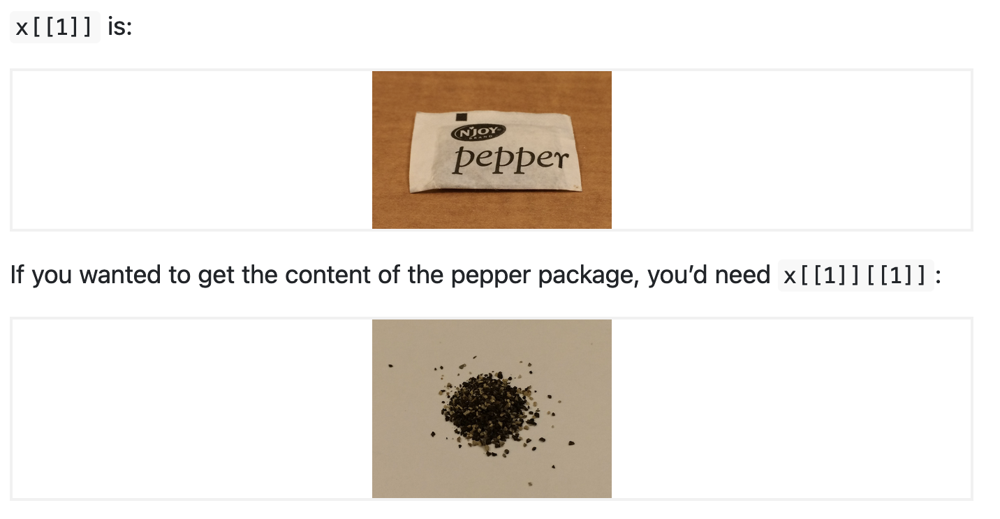

```{r echo = FALSE}
library(renderthis)
to_pdf(from = "lecture4.html",complex_slides = TRUE)
```


```{r echo=FALSE}
xaringanExtra::use_xaringan_extra(c("tile_view", "animate_css", "tachyons"))
xaringanExtra::use_panelset()
```

```{r setup, include=FALSE}
knitr::opts_chunk$set(
  comment = "",eval = TRUE,fig.retina = 2, message=F, warning = F
)
```

```{r packages, echo=FALSE, message=FALSE, warning=FALSE}
library(dplyr)
library(ggplot2)
library(unvotes)
```


```{css, echo = FALSE}
.tiny .remark-code { font-size: 60%; }
.small .remark-code { font-size: 80%; }
```

## Reminders

- Homework 1 has been assigned: (Due April 17 midnight, cover lecture 1-4)
  - start as soon as possible
  - PDF files only
  - Submission through Gradescope (accessible through Canvas)
  - If you get stuck, it's encouraged to communicate with your mate about solution.
  - But you should type your solution by your own.
  - If you collaborate with others, write their names in your submission

- Office hours: 
  - TBD

- Lecture 1 - 3 we covered vectors and basics of R, R markdown.

- From now on we will start working with data.

---

## Today

- Introduction to lists

- Data frames, or more generally "data sets"

- Auto complete and How to use help in R

???

Today's topics are lists and data frames, which are both important data structures in R.

---

## Lists
- Lists are a generic container
- Sequence of values, _not_ necessarily all of the same type 
  - (Vector has to be the same type!)

```{r}
my.distribution <- list("exponential", 7, FALSE)
my.distribution
```

- Most of what you can do with vectors you can also do with lists
- This is an unnamed list

???

Lists are a generic container in R that can hold a sequence of values that are not necessarily all of the same type. Unlike vectors, which have to be the same type, lists can contain elements of any type.

In the example code shown on the slide, we create a list called my.distribution that contains three elements: the string "exponential", the number 7, and the Boolean value FALSE. We can see that this list is created using the list() function, which takes the individual elements as arguments.

Most of what we can do with vectors in R, we can also do with lists. This includes subsetting, indexing, and applying functions to the elements of the list. In fact, lists are often used in R to store complex data structures that are difficult to represent using vectors or other data types.

It's important to note that the list shown on the slide is an unnamed list, which means that its elements are not named. 

---
## Lists

- Elements can be vectors of **any type**, or other data structures like data frame (We will cover that later this lecture)

- This is a named list

```{r}
l <- list(
  x = 1:4,
  y = c("hi", "hello", "jello"),
  z = data.frame(a = c(1,2), b = c(3,4))
)
l
```

???

Elements of a list can be vectors of any type or other data structures, like data frames. This makes lists can be used to represent complex data structures.

In the example code shown on the slide, we create a named list called l that contains three elements:

A vector of integers from 1 to 4, named x
A vector of strings, named y
A data frame with two columns named a and b, respectively, containing the values 1, 2 and 3, 4.

We can see that each element in the list is named using the syntax name = value. This allows us to access individual elements of the list by name, which can be very useful when working with complex data structures.

---
## Lists
Make an empty list to fill in later
```{r}
myList <- vector(mode = "list", length = 4)
myList
```

???

In the example code shown on the slide, we create an empty list called myList with a length of 4 using the vector() function. We can see that this creates a list with four elements that are all NULL.

This technique of creating an empty list is useful when we want to store data that we will collect or compute later in our code.

---

## Accessing pieces of lists
Can use `[ ]` as with vectors  

or use `[[ ]]`, but only with a single index  
`[[ ]]` drops names and structures, `[ ]` does not

```{r}
l[1]
l[[1]]
```
<small>Does `l[[1:2]]` work?</small>


???

In R, we can use [ ] to subset a list and access individual elements, just like with vectors. We can use integer indices or Boolean vectors to subset the list.

Alternatively, we can use [[ ]] to access individual elements, but only with a single index. [[ ]] drops any names and structures associated with the element and returns only its value.

In the example code shown on the slide, l[1] returns a new list containing only the first element of l, while l[[1]] returns the actual value of the first element.

Does `l[[1:2]]` work?

We cannot use [[ ]] with a range of indices, like l[[1:2]].

It's important to note that [[ ]] drops names and structures associated with the element, while [ ] does not.

---
## Accessing pieces of lists
Helpful illustration from R for Data Science (Chapter 20.5.3):

.pull-left[
```{r echo=FALSE, out.width="110%"}

```
]

.pull-right[
```{r echo=FALSE, out.width="110%"}

```
]

> Summary: [] subset will still be a list, not an element. If you want to access the element, use [[]]


???

???

In R, we can use [ ] to subset a list and access individual elements, just like with vectors. We can use integer indices or Boolean vectors to subset the list.

Alternatively, we can use [[ ]] to access individual elements, but only with a single index. [[ ]] drops any names and structures associated with the element and returns only its value.

In the example code shown on the slide, l[1] returns a new list containing only the first element of l, while l[[1]] returns the actual value of the first element.

We cannot use [[ ]] with a range of indices, like l[[1:2]].

It's important to note that [[ ]] drops names and structures associated with the element, while [ ] does not.

---


## Working with lists 

.pull-left[
```{r}
my.distribution
```
]

.pull-right[
```{r}
is.character(my.distribution)
is.character(my.distribution[[1]])
my.distribution[[2]]^2
```
]

<small>What happens if you try `my.distribution[2]^2`?</small>
<small>What happens if you try `[[ ]]` on a vector?</small>

???

In the code shown on the slide, we have a list called my.distribution with three elements of different types. We can use is.character() to check if my.distribution is a character vector, which returns FALSE. However, if we use is.character() on my.distribution[[1]], we get TRUE because the first element is a character string.

We can also perform arithmetic operations on the elements of the list, such as my.distribution[[2]]^2 which squares the second element of the list, returning the value 49.

What happens if you try `my.distribution[2]^2`

What happens if you try `[[ ]]` on a vector?

If we try to use the [ ] or [[ ]] operator on a vector instead of a list, we get the same result, because a vector is treated as a list with a single element. For example, my.vector <- c(1, 2, 3) and my.vector[[2]] both return the value 2. However, we cannot use the [[ ]] operator with a range of indices on a vector, because it returns an error.

---
## Filling in lists 
```{r}
myList[[1]] <- 1:10
# Fill the first element with a vector 1:10
myList
```
<small>What happens if you try `myList[1] <- 1:10`?</small>

> Summary: Rememeber when you want to **access** or **assign** with an element in a list, use [[]]!!!

???

It will be an error. number of items to replace is not a multiple of replacement length

It's important to remember to use [[ ]] to access or assign individual elements of a list, and to use [ ] only for subsetting a list or extracting multiple elements at once.

---

## Expanding and contracting lists

Add to lists with `c()` (also works with vectors):
```{r}
my.distribution <- c(my.distribution, 7)
my.distribution

# vector:
a = c(1,2,3)
c(a, 4)
```

???

We can use the c() function to concatenate or add new elements to a list.

In the example code shown on the slide, we use c() to add the value 7 to the end of the list my.distribution. We can see that the new value is added as a separate element at the end of the list.

We can also use c() to add new elements to a vector or create a new vector by combining two or more existing vectors, as shown in the example code for the vector a. In this case, the c() function returns a new vector that includes the original vector a and the value 4 concatenated together.

---

Chop off the end of a list by setting the length to something smaller (also works with vectors):

```{r}
length(my.distribution)
length(my.distribution) <- 3
my.distribution
length(a) = 3
a
```

???
In the example code shown on the slide, we use length() to get the current length of my.distribution. We then modify the length of the list by setting it to 3, effectively removing the last element of the list.

We can also use length() to modify the length of a vector, as shown in the example code for the vector a. In this case, we set the length of the vector to 3, effectively removing the last element of the vector.

---

## Naming list elements

- We saw how to name elements of a list while constructing them

- We can also add names later on:

```{r}
my.distribution <- list("exponential", 7, FALSE)
names(my.distribution) <- c("family", "mean", "is.symmetric")
my.distribution
```
???

We can assign names to the elements of a list by using the names() function. This function takes a list as its argument. 

In the example code shown on the slide, we first create a list called my.distribution with three elements of different types. We then assign names to the elements of the list using the names() function, where the character vector c("family", "mean", "is.symmetric") represents the names we want to assign to the elements of the list. We can see that the names are added to the list and displayed next to each element, making it easier to understand the contents of the list.

Assigning names to the elements of a list can be useful when working with large or complex data structures, as it allows us to refer to specific elements by name rather than index, making our code more readable and easier to understand.

---

## Accessor sign `$`

Lists have a special short-cut way of using names, `$` (which removes names and structures):

```{r}
my.distribution[["family"]]
my.distribution$family
my.distribution[1]
```

> Using the $ operator can make our code more readable and easier to understand, especially when working with large or complex data structures
 
???

We can use the $ symbol as a shortcut for accessing the elements of a list by name. 

In the example code shown on the slide, we use the $ operator to access the "family" element of the list my.distribution. We can see that this returns the same value as using the [[ ]] operator with the name of the element as its argument.

Using the $ operator can make our code more readable and easier to understand, especially when working with large or complex data structures where we need to refer to specific elements by name.

---

## Names in lists 

Creating a list with names:
```{r}
another.distribution <- list(family="gaussian", mean = 7, 
                             sd = 1, is.symmetric = TRUE)
```

Adding named elements:
```{r}
my.distribution$was.estimated <- FALSE
my.distribution[["last.updated"]] <- "2011-08-30"
```

Removing a named list element, by assigning it the value `NULL`:
```{r}
my.distribution$was.estimated <- NULL
```

???

We can create a named list using the list() function and the name=value syntax. We can add named elements to an existing list using the $ or [[ ]] operators and the name=value syntax. To remove a named element from a list, we can assign it the value NULL.

---

## Structure of lists

- `str()` is particularly useful for lists, since it allows us to easily get an idea of what is in the list. 

- We can use str() to see the structure of a list, including the data types and names of each element in the list.

```{r}
str(my.distribution)
```

---

## Data frames

- A data frame is a special **list** containing vectors of **equal length**

- Data frame = the classic data table, $n$ rows for observations, $p$ columns for variables

- Lots of the statistical parts of R presume data frames

- *columns can have different types*: String, numeric, Date, Boolen, etc

???

n R, a data frame is a special type of list that contains vectors of equal length. It is used to store a table of data with rows representing observations and columns representing variables. Many statistical parts of R are designed to work specifically with data frames.

Unlike a simple list, data frames have a specific structure that allows columns to have different data types such as strings, numerics, dates, and booleans. 

---
## Creating data frames 

* Use the data.frame() function to create a dataframe

* We can use `dim()` function to know how many row and columns.

```{r}
# create a data frame with three variables
my.df <- data.frame(
  x = 1:3,
  y = c("a", "b", "c"),
  z = c(TRUE, FALSE, TRUE)
)
# print the data frame
my.df
dim(my.df)
```

???

In this example, we use the data.frame() function to create a data frame called my.df with three variables. The first variable, x, is a sequence of integers from 1 to 3. The second variable, y, is a vector of character strings that correspond to the letters "a", "b", and "c". The third variable, z, is a vector of Boolean values that correspond to TRUE, FALSE, and TRUE.

After creating the data frame, we can print it to the console to see its contents. The output shows that my.df has three variables and three observations.

We can use `dim()` function to know how many row and columns.

---

## Accessing dataframe

* Use $ accessor to access a specific column of a data frame by name. 

* For example, `my.df$column_name` returns the values of the `column_name` column. 
   - (Which will be a vector)

```{r}
my.df$x
```

* Row and column index: we can use the [ ] operator with row and column index to access individual elements of a data frame. 
  - For example, `my_df[row_index, col_index]` returns the value in the `row_index`-th row and `col_index`-th column.

```{r}
my.df[2, 3]
```

???

We can access individual elements, rows, and columns of a data frame using different indexing methods:

dollar accessor: we can use to access a specific column of a data frame by name. For example, `my_df$column_name` returns the values of the column_name column.

Row and column index: we can use the [ ] operator with row and column index to access individual elements of a data frame. For example, `my_df[row_index, col_index]` returns the value in the `row_index`-th row and `col_index`-th column.

---

* Rows or columns by index: we can use the [ ] operator to access entire rows or columns of a data frame by index
  - For example, `my_df[row_index, ]` returns the `row_index`-th row of the data frame, and `my_df[, col_index]` returns the `col_index`-th column.

```{r}
# Use row index to get a row
my.df[3, ]

# Use column index to get a column
my.df[, 2]
```

* You can also use index vectors on the row or column arguments.

```{r}
my.df[c(1,2),c(1,2)]
```

---

## Adding rows and columns

We can add columns using $ accessor

```{r}
# Adding columns
my.df$new.col <- 4:6
my.df
```

We can also add columns similar to a list

```{r}
my.df[["newer.col"]] <- c(7, 8, 9)
my.df
```

---

## remove column

Now remove `newCol`

```{r}
# Removing column 3
my.df <- my.df[, -3]
# We can also remove by this way
my.df$new.col <- NULL
```

> Some are very similar to a list operation.

---
## `rbind()` and `cbind()`

We can also add rows or columns to an array or data-frame with `rbind()` and `cbind()`.

.panelset[
.panel[.panel-name[rbind]
```{r}
# Create a data frame
df <- data.frame(
  x = 1:3,
  y = c("a", "b", "c"),
  z = c(TRUE, FALSE, TRUE)
)

# Add a new row
new_row <- data.frame(x = 4, y = "d", z = FALSE)
df <- rbind(df, new_row)
df
```

]
.panel[.panel-name[rbind_df]
```{r}
# Creating two data frames to combine
df1 <- data.frame(x = 1:3, y = c("a", "b", "c"))
df2 <- data.frame(x = 4:6, y = c("d", "e", "f"))

# Using rbind to combine rows
df3 <- rbind(df1, df2)
df3
```

]
.panel[.panel-name[cbind]
```{r}
# Create a data frame
df <- data.frame(
  x = 1:3,
  y = c("a", "b", "c"),
  z = c(TRUE, FALSE, TRUE)
)

# Add a new column
new_col <- c(4, 5, 6)
df <- cbind(df, new_col)
df
```

]
.panel[.panel-name[cbind_df]
```{r}
# Creating two data frames to combine
df1 <- data.frame(x = 1:3, y = c("a", "b", "c"))
df2 <- data.frame(z = c(TRUE, FALSE, TRUE), w = c(0.5, 1.2, 2.1))

# Using cbind to combine columns
df3 <- cbind(df1, df2)
df3
```

]
]

???

The rbind() function requires that both data frames have the same number of columns, while cbind() requires that both data frames have the same number of rows.

Remember the vector can be treat as dataframes.

This is because rbind() stacks the data frames vertically, while cbind() stacks them horizontally.

---

## More complicated data structures: structures of structures


.panelset[
.panel[.panel-name[Words]
- Internally, a data frame is basically a list of vectors  
- List elements can even be other lists, 
  - which may contain other data structures, including other lists,  
  - which may contain other data structures...

- This **recursion** lets us build arbitrarily complicated data structures from the basic ones

]
.panel[.panel-name[Code example]
```{r}
df1 <- data.frame(x = 1:3, y = c("a", "b", "c"))
df2 <- data.frame(x = 4:6, y = c("d", "e", "f"))
nested_list <- list(df1 = df1, df2 = df2)
str(nested_list)
```

]
.panel[.panel-name[Output]
```{r}
nested_list
```

]

.panel[.panel-name[Explanation]
In this example, we create two data frames, `df1` and `df2`, and then create a list called `nested_list` containing these two data frames as elements. We can see that nested_list is a list with two elements, each of which is a data frame, by using the `str()` function to print the structure of the list.
]
]

???

In this example, we create two data frames, df1 and df2, and then create a list called nested_list containing these two data frames as elements. We can see that nested_list is a list with two elements, each of which is a data frame, by using the str() function to print the structure of the list.


---

## Autocomplete and help

.panelset[
.panel[.panel-name[Autocomplete]
* RStudio has a powerful autocomplete feature that makes it easy to write code and reduce errors

* To use the autocomplete feature, simply start typing a function or variable name and press the TAB key

* RStudio will display a list of possible completions, including function names, variable names, and other objects in your workspace

* You can select the desired completion from the list using the up and down arrow keys or by clicking on the item with your mouse

* Autocomplete also works with other types of text, such as file paths and package names
]

.panel[.panel-name[seq() example]
- Let’s try using `seq()` which makes regular **seq**uences of numbers
- Type `se` and hit TAB. A popup shows you possible completions.

- Specify `seq()` by typing more (a "`q`") to disambiguate

- Press TAB once more when you’ve selected the function you want. RStudio will add matching opening (() and closing ()) parentheses for you.

- Type the arguments 1, 10 and hit return.

```{r}
seq(1,10)
```

]
.panel[.panel-name[Get help of a function]

- Type `?function_name` in console to get help of a function. The help will be in "help" panel to the right.

```{r eval = F}
?seq
```

The help documentation is divided into several sections, including:

- Description: a brief summary of what the function does.
- Usage: the syntax of the function, including any required and optional arguments.
- Arguments: a description of each argument, including its name, data type, and default value.
- Details: additional information about the function's behavior or how to use it.
- Value: the type of output produced by the function.
- Examples: example code demonstrating how to use the function.
]
.panel[.panel-name[help page]

[links here](https://www.rdocumentation.org/packages/base/versions/3.6.2/topics/seq)

* It will be the same when you use `?seq` on your own computer

]]

---

## Recap: install packages

* What you get after your first install is base R

* extra functionality comes from add-ons available from developers

* R makes it very easy to install packages from within R. For example, type this in console

```{r eval=F}
install.packages("tidyverse")
install.packages("ggplot2")
install.packages("dslabs")
```

After we install the package, we can then load the package into our R sessions using the library function:

```{r eval=F}
library(tidyverse)
library(dslabs)
```

If you want to use the add-on functions in the package, you need to library the package first.

---

## Built-in Dataframes

For example, we stored the data for US gun murder in a data frame. You can access this dataset by loading the __dslabs__ library and loading the `murders` dataset using the `data` function:

```{r warning = F}
library(dslabs)
data(murders)
```

To see that this is in fact a data frame, we type:

```{r}
class(murders)
```


---

## Data frames, data sets  

- We've seen data frames. This is a commonly used data structure that we get after reading in a data set into R. 

- In a data set in general, 
  - Each row is an **observation**, $n$
  - Each column is a **variable**, $p$

- Often, the first things we want to do when given a data set are to figure out
  1. What is in it (what dimensions, what variables)
  2. What the main characteristics of the variables are. 

- We've seen a few tools and functions for working with data frames in "base R," now we will look at some tools from `dplyr`

---
```{r echo=FALSE, out.width="100%"}
knitr::include_graphics("img/tidyverse.png")
```
https://www.tidyverse.org/
- What we've seen so far: "base R"
- `ggplot2` for plotting, `dplyr` for data manipulation


---
## First question: What's in a data set?

### Example: Star Wars data 

- `starwars` data set in the `dplyr` package 

(A `tibble` is the `tidyverse` version of the data frame.)

```{r message=FALSE}
dplyr::starwars
```

---


We've seen `str()`. `dplyr::glimpse()` produces cleaner output in this case:

```{r}
dplyr::glimpse(starwars)
```

---

How many rows and columns does this data set have? What does each row represent? What does each column represent?

```{r eval = FALSE}
?starwars
```

```{r echo=FALSE, out.width="100%"}
knitr::include_graphics("img/starwars-help.png")
```

---

How many rows and columns does this data set have?

```{r}
nrow(starwars) # number of rows
ncol(starwars) # number of columns
dim(starwars)  # dimensions (row column)
```

As we've seen, columns (variables) in data frames can be accessed with `$`:

```{r eval=FALSE}
dataframe$var_name
```


---

### Next lecture we will start data manipulation!

# Readings

- R for Data Science Chapter 4, 20
- [Chapter 2:R basics](http://rafalab.dfci.harvard.edu/dsbook/r-basics.html)
- [Chapter 3](http://rafalab.dfci.harvard.edu/dsbook/programming-basics.html)