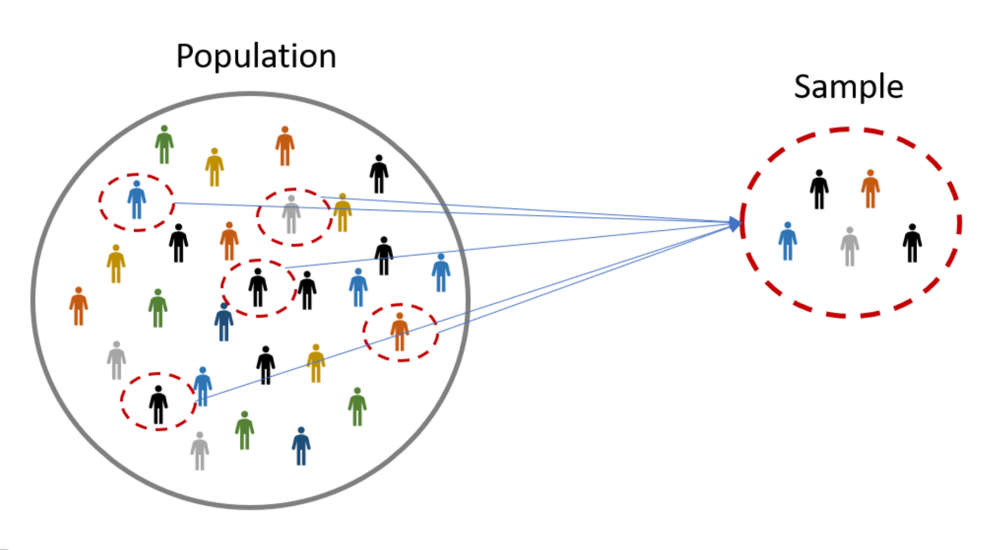

```{r, echo = FALSE, eval = FALSE}
library(renderthis)
to_pdf(from = "lecture8.html",complex_slides = TRUE)
```


```{r xaringanExtra, echo=FALSE}
xaringanExtra::use_xaringan_extra(c("tile_view", "animate_css", "tachyons"))
xaringanExtra::use_panelset()
```

```{r setup, include=FALSE}
knitr::opts_chunk$set(
  comment = "",eval = TRUE,fig.retina = 2, message=F, warning = F
)
```

```{r packages, echo=FALSE, message=FALSE, warning=FALSE}
library(dplyr)
library(ggplot2)
library(unvotes)
```


```{css, echo = FALSE}
.tiny .remark-code { font-size: 60%; }
.small .remark-code { font-size: 80%; }
```


## Reminders

- HW 2 due April 26 12pm.

- Please start the homework as soon as possible.

## Today

- Facets

- Time series

- Descriptive statistics

---

## Recap (With lecture7 example recaps)

- Data visualization with ggplot

> Remember, before using all tidyverse functions, you need to library(tidyverse) first!

> Remember, before using all ggplot2 functions, you need to library(ggplot2) first!

---
## A note on piping and layering

- Pipe `%>%` used mainly in `dplyr` pipelines
  - Pipe the output of the previous line of code as the first input of the next line of code

- `+` used in `ggplot2` plots is used for "layering"
  - Create the plot in layers, separated by `+`

---
```{r message=FALSE, echo = FALSE}
library(palmerpenguins)
hotels <- readr::read_csv("../lecture 6/data/hotels.csv")
```

## dplyr

`r emo::ji("x")`

```{r error=TRUE}
hotels +
  select(hotel, lead_time)
```

`r emo::ji("white_check_mark")`

```{r eval=FALSE}
hotels %>%
  select(hotel, lead_time)
```

.tiny[
```{r echo=FALSE, output.lines=6}
hotels %>%
  select(hotel, lead_time)
```
]

---

## ggplot2

`r emo::ji("x")`

.small[
```{r error=TRUE}
ggplot(hotels, aes(x = hotel, fill = deposit_type)) %>%
  geom_bar()
```
]

`r emo::ji("white_check_mark")`

```{r out.width="25%"}
ggplot(hotels, aes(x = hotel, fill = deposit_type)) +
  geom_bar()
```


---
## Code styling

Many of the styling principles are consistent across `%>%` and `+`:

- always a space before
- always a line break after (for pipelines with more than 2 lines)

`r emo::ji("x")`

```{r eval=FALSE}
ggplot(hotels,aes(x=hotel,y=deposit_type))+geom_bar()
```

`r emo::ji("white_check_mark")`

```{r eval=FALSE}
ggplot(hotels, aes(x = hotel, y = deposit_type)) + 
  geom_bar()
```

---

## Today

- Finishing up on `ggplot()`

  - Faceting using `facet_grid()`

  - Time series plot
  
- Descriptive statistics 


---

### `facet_grid()`


.panelset[
.panel[.panel-name[Overview]

- `facet_grid()`:
    - 2D grid
    - `rows ~ cols`
    - use `.` for no split (1D)

- Uses all levels, even if there are no observations; i.e., may produce empty plots 

]
.panel[.panel-name[2D grid 1]
```{r warning = FALSE, fig.height=5}
ggplot(penguins, aes(x = bill_depth_mm, y = bill_length_mm)) + 
  geom_point() +
  facet_grid(species ~ sex) #<<
```
]
.panel[.panel-name[2D grid 2]
```{r warning = FALSE, fig.height=5}
ggplot(penguins, aes(x = bill_depth_mm, y = bill_length_mm)) + 
  geom_point() +
  facet_grid(sex ~ species) #<<
```
]
.panel[.panel-name[1D grid 1]
```{r warning = FALSE, fig.height = 5}
ggplot(penguins, aes(x = bill_depth_mm, y = bill_length_mm)) + 
  geom_point() +
  facet_grid(. ~ species) #<<
```
]
.panel[.panel-name[1D grid 2]
```{r warning = FALSE, fig.height=5}
ggplot(penguins, aes(x = bill_depth_mm, y = bill_length_mm)) + 
  geom_point() +
  facet_grid(species ~ .) #<<
```
]
]
???

The facet_grid() function in ggplot2 allows us to create a 2D grid of plots, with rows and columns defined by the levels of two different categorical variables. 

We specify this using the rows ~ cols syntax. We can also use . to indicate that we only want to split the plots in one dimension, instead of two.

The remaining panels show different examples of how to use facet_grid(). Each example uses the penguins dataset and plots the relationship between two continuous variables, bill_depth_mm and bill_length_mm. The plots are faceted by the species and sex variables in different ways. 

The first two panels show 2D grids with the species variable on the rows and sex variable on the columns, and vice versa. 
The third and fourth panels show 1D grids with the species variable on the rows or columns, and an empty space for the other dimension. These examples demonstrate the flexibility and usefulness of facet_grid() in creating visualizations for different types of data.

---

## Facet can be used with color

* Perfect for complex comparison

.pull-left[
```{r facet-color-legend, fig.show = "hide", warning = FALSE}
ggplot(
  penguins, 
  aes(x = bill_depth_mm, 
      y = bill_length_mm, 
      color = species)) + #<<
  geom_point() +
  facet_grid(year ~ sex) +
  scale_color_viridis_d() #<<
```
]

.pull-right[
```{r ref.label = "facet-color-legend", echo = FALSE, warning = FALSE, out.width = "100%"}
```
]

???

Here we demonstrates how facet_grid() can be used in combination with color to create a multi-panel scatter plot with a legend for color. This type of picture enables us to create complex comparisons between multiple variables.

The example code uses the penguins dataset, mapping bill_depth_mm and bill_length_mm to the x and y aesthetics, respectively, and species to the color aesthetic. facet_grid() is used to create a grid of panels arranged by year and sex. 

Finally, scale_color_viridis_d() is used to specify a color scale for the legend.

---

### `facet_wrap`


.panelset[
.panel[.panel-name[Overview]
* To explore how the fertility against life_expectancy happened through the years, we can make the plot for several years.

* `facet_wrap` allows us to display multiple rows and columns of plots so that each has viewable dimensions.

* You can change the column numbers in `ncol=?`

* `facet_grid` 1D will make it too thin to show the data.

* The plot shows how most Asian countries have improved at a much faster rate than European ones.

* Default scale are fixed.

]
.panel[.panel-name[Code]
```{r  eval = FALSE}
library(dslabs)
data(gapminder)
years <- c(1962,1970, 1980, 1990, 2000, 2012)
continents <- c("Europe", "Asia")
gapminder |> 
  filter(year %in% years & continent %in% continents) |>
  ggplot( aes(fertility, life_expectancy, col = continent)) +
  geom_point() +
  facet_wrap(~year, ncol = 3) #<<
```
]
.panel[.panel-name[Plot]
```{r  echo = FALSE, fig.height=6}
library(dslabs)
data(gapminder)
years <- c(1962,1970, 1980, 1990, 2000, 2012)
continents <- c("Europe", "Asia")
gapminder |> 
  filter(year %in% years & continent %in% continents) |>
  ggplot( aes(fertility, life_expectancy, col = continent)) +
  geom_point() +
  facet_wrap(~year, ncol = 3)  #<<
```
]
]


???

To explore how this the fertility against life_expectancy happened through the years, we can make the plot for several years. For example, we can add 1970, 1980, 1990, and 2000. If we do this, we will not want all the plots on the same row, the default behavior of `facet_grid`, since they will become too thin to show the data. Instead, we will want to use multiple rows and columns. The function `facet_wrap` permits us to do this by automatically wrapping the series of plots so that each display has viewable dimensions:

This plot clearly shows how most Asian countries have improved at a much faster rate than European ones.

The default choice of the range of the axes is important. When not using `facet`, this range is determined by the data shown in the plot. When using `facet`, this range is determined by the data shown in all plots and therefore kept fixed across plots. This makes comparisons across plots much easier. For example, in the above plot, we can see that life expectancy has increased and the fertility has decreased across most countries. We see this because the cloud of points moves. 

---

### Fixed scales or free scales

```{r facet-without-fixed-scales, warning=FALSE, fig.height=5}
filter(gapminder, year%in%c(1962, 2012)) |>
  ggplot(aes(fertility, life_expectancy, col = continent)) +
  geom_point() +
  facet_wrap(. ~ year, scales = "free") #<<
```
???

This is not the case if we adjust the scales:

In the plot above, we have to pay special attention to the range to notice that the plot on the right has a larger life expectancy. 

---

## Time series plots

.panelset[
.panel[.panel-name[Overview]
* Time series plots have time on the x-axis and an outcome of interest on the y-axis
* Effective for exploring temporal changes
* Use `geom_line()` to connect the points with lines and create curves for each series
* `color` aesethic assigns different colors to different series and groups the data automatically
]
.panel[.panel-name[Points]
.pull-left[
.tiny[
```{r fertility-time-series-plot-points, fig.show = "hide", warning = FALSE}
gapminder |> 
  filter(country == "United States") |> 
  ggplot(aes(year, fertility)) +
  geom_point()
```
]]
.pull-right[
```{r ref.label = "fertility-time-series-plot-points", echo = FALSE, warning = FALSE, out.width = "100%"}
```
]
]

.panel[.panel-name[Curve]
.pull-left[
.tiny[
```{r fertility-time-series-plot-curve, fig.show = "hide", warning = FALSE}
gapminder |> 
  filter(country == "United States") |> 
  ggplot(aes(year, fertility)) +
  geom_line()
```
]]
.pull-right[
```{r ref.label = "fertility-time-series-plot-curve", echo = FALSE, warning = FALSE, out.width = "100%"}
```
]
]
.panel[.panel-name[Color]
.pull-left[
.tiny[
```{r  fertility-time-series-plot, fig.show = "hide", warning = FALSE}
countries <- c("South Korea","Germany")
gapminder |> 
  filter(country %in% countries &
           !is.na(fertility)) |> 
  ggplot(aes(year,fertility,
             col = country)) +
  geom_line()
```
]]
.pull-right[
```{r ref.label = " fertility-time-series-plot", echo = FALSE, warning = FALSE, out.width = "100%"}
```
]
]
]

???
1-2

The visualizations last slide showed the result changes over time. Once we see these plots, new questions emerge. For example, which countries are improving more and which ones less? Was the improvement constant during the last 50 years or was it more accelerated during certain periods? For a closer look that may help answer these questions, we introduce _time series plots_.

Time series plots have time in the x-axis and an outcome or measurement of interest on the y-axis. For example, here is a trend plot of United States fertility rates:

We see that the trend is not linear at all. Instead there is sharp drop during the 1960s and 1970s to below 2. Then the trend comes back to 2 and stabilizes during the 1990s.

3

When the points are regularly and densely spaced, as they are here, we create curves by joining the points with lines, to convey that these data are from a single series, here a country. To do this, we use the `geom_line` function instead of `geom_point`. 

4

This is particularly helpful when we look at two countries. If we subset the data to include two countries, one from Europe and one from Asia, then we can use the `color` argument to assign different colors to the different countries is that the data is automatically grouped:

The plot clearly shows how South Korea's fertility rate dropped drastically during the 1960s and 1970s, and by 1990 had a similar rate to that of Germany.

---

### Labels instead of legends 

* We can use label instead of legends  using the `geomtextpath` package.

.panelset[
.panel[.panel-name[code]
```{r eval = F}
library(geomtextpath)
gapminder |> 
  filter(country %in% countries) |> 
  ggplot(aes(year, life_expectancy, 
             col = country, label = country)) + #<<
  geom_textpath() +
  theme(legend.position = "none")
```
]
.panel[.panel-name[plot]
```{r echo = F, fig.height=6}
library(geomtextpath)
gapminder |> 
  filter(country %in% countries) |> 
  ggplot(aes(year, life_expectancy, col = country, label = country)) + #<<
  geom_textpath() +
  theme(legend.position = "none")
```
]
.panel[.panel-name[words]
For trend plots we recommend labeling the lines rather than using legends since the viewer can quickly see which line is which country. This suggestion actually applies to most plots: labeling is usually preferred over legends.


We demonstrate how we can do this using the `geomtextpath` package. We define a data table with the label locations and then use a second mapping just for these labels:

The plot clearly shows how an improvement in life expectancy followed the drops in fertility rates. In 1960, Germans lived 15 years longer than South Koreans, although by 2010 the gap is completely closed. It exemplifies the improvement that many non-western countries have achieved in the last 40 years.
]
]

???

For trend plots we recommend labeling the lines rather than using legends since the viewer can quickly see which line is which country. This suggestion actually applies to most plots: labeling is usually preferred over legends.


We demonstrate how we can do this using the `geomtextpath` package. We define a data table with the label locations and then use a second mapping just for these labels:

The plot clearly shows how an improvement in life expectancy followed the drops in fertility rates. In 1960, Germans lived 15 years longer than South Koreans, although by 2010 the gap is completely closed. It exemplifies the improvement that many non-western countries have achieved in the last 40 years.

---

## Descriptive statistics

- We've now learned about data manipulation and visualization tools

- What visualizations to do and what summary statistics to actually calculate?

- **Descriptive statistics** are numbers that are used to summarize and describe data

- **Numerical** or **graphical** ways to display the data

- Why is this a useful thing to do?

.tiny[
>Descriptive statistics are a useful tool in data analysis, as they help us understand and communicate the patterns and characteristics of a dataset. 
]

???

We've now learned about basic data manipulation and visualization tools. Now we want to learn what visualizations to do and what summary statistics to actually calculate.

First we need to discuss the descriptive statistics, which are used to summarize and describe data in both numerical and graphical ways. 

Descriptive statistics are a useful tool in data analysis, as they help us understand and communicate the patterns and characteristics of a dataset. 

We will start with some terminology used in statistics.

---

## Terminology of statistics

.small[
* A **subject**: A person, place or thing from which we collect data.

* A **population**: The collection of all subjects of interest.

* A **sample**: A subset of the population, from which we have collected data

> Sample is a subgroup of population!

> **Sample size**: number of subjects in a sample

* Ideally, a sample should be **representative** of the population.

```{r echo=FALSE, out.width="60%"}

```

]

???

We introduce some basic definitions and concepts related to descriptive statistics.

In this picture...

---

## Terminology: continued


- A **variable**: A characteristic of a subject

- A **distribution** of a variable: the way the values of the variable are spread out or distributed over all possible values.

- **Univariate** data analysis: distribution of single variable

- **Bivariate** data analysis: relationship between two variables

- **Multivariate** data analysis: relationship between many variables at once, usually focusing on the relationship between two while conditioning for others

---

## Terminology: Types of variables

- **Numerical** variables
  - E.g., age, length, temperature
  
  - **Continuous** variables can take on an infinite number of values
  
  - **Discrete** Numbers can only take on a *finite* or *countably infinite set* (Such as all integers) of possible values

- **Categorical** variables

  - E.g., year in college, type of bike, meal 
  
  - **Ordinal** variables have levels that have a natural ordering
  
  - **Nominal** variables without any order
  
  > All genders, ethnicity, religions are equal!

???

Then, let's illustrate these concepts using the R example.

---

### Examples

.panelset[
.panel[.panel-name[murders]

For the `murders` dataset in `dslabs` package, we take a sample of 3 states:

```{r}
library(dslabs)
head(murders, 3)
```

* **subject** is one US state. 
* **population** is ALL US state. 
* **sample** is Alabama, Alaska, Arizona for this small sample presented here.
* **variable** include: region, population, total (murders)

* abb, region are **categorical; nominal**

* population and total are **numeric; discrete**

]
.panel[.panel-name[heights help page]

For the `heights` dataset in `dslabs` package, we use help to get information of `heights` dataset

```{r eval = F}
?heights
```

* Self-Reported Heights

> Description: Self-reported heights in inches for males and females.

>Usage: data(heights)

>Format: An object of class "data.frame".

>Details:sex. Male or Female.

> height. Height in inches.

]

.panel[.panel-name[heights]
.small[
```{r}
head(heights, 3)
# Here we have 1050 observations
dim(heights)
```

So for this dataset:

* **subject** is one student (possibly in some school). 
* **population** is all students inside that school. 
* **sample** is the 1050 students inside the dataset.
* **variable** include: sex, height

* sex is **categorical; nominal**

* height is **numeric; continuous**

  - Though here it seems to only include integer values.]

]
.panel[.panel-name[Small quiz]

What are the types of these variables?

- Number of people in each class

- Letter grades

- Shape of leaf

- Zip code: (95618 for Davis, 95776 for Woodland)

- Heights of newborn babies
]

.panel[.panel-name[solution]
- Number of people in each class **discrete**

- Letter grades **ordinal**

- Shape of leaf **nominal**

- Zip code: (95618 for Davis, 95776 for Woodland) **nominal**

- Heights of newborn babies **continuous**
]
]

---

## Data: Lending Club

- Lending Club is a platform that allows individuals to lend to other individuals

- Data are available in the `openintro` package, called `loans_full_schema`

- Includes 10,000 loans made through the Lending Club; has 55 columns

.tiny[
```{r }
library(openintro)
dplyr::glimpse(loans_full_schema) 
```
]

???

From now on we will use another dataset to illustrate how to describing the distributions.

---

## Selected variables

```{r}
loans <- loans_full_schema %>%
  select(loan_amount, interest_rate, term, grade, 
         state, annual_income, homeownership, debt_to_income,
         issue_month)
glimpse(loans)
```

---

## Selected variables

.small[
Variable        | Description
----------------|-------------
`loan_amount`   |	Amount of the loan received, in US dollars
`interest_rate` |	Interest rate on the loan, in an annual percentage
`term`	        | The length of the loan, which is always set as a whole number of months
`grade`	        | Loan grade, which takes a values A through G and represents the quality of the loan and its likelihood of being repaid
`state`         |	US state where the borrower resides
`annual_income` |	Borrower’s annual income, including any second income, in US dollars
`homeownership`	| Indicates whether the person owns, owns but has a mortgage, or rents
`debt_to_income` | Debt-to-income ratio
`issue_month` | Month the loan was issued
]

---

## Variable types

.small[
Variable        | Description
----------------|-------------
`loan_amount`   |	Amount of the loan received, in US dollars
`interest_rate` |	Interest rate on the loan, in an annual percentage
`term`	        | The length of the loan, which is always set as a whole number of months
`grade`	        | Loan grade, which takes a values A through G and represents the quality of the loan and its likelihood of being repaid
`state`         |	US state where the borrower resides
`annual_income` |	Borrower’s annual income, including any second income, in US dollars
`homeownership`	| Indicates whether the person owns, owns but has a mortgage, or rents
`debt_to_income` | Debt-to-income ratio
`issue_month` | Month the loan was issued
]

- Numerical variables: Continuous or discrete?
- Categorical: Ordinal or not? 

---

## Variable types

Variable        | Type
----------------|-------------
`loan_amount`   |	numerical, continuous
`interest_rate` |	numerical, continuous
`term`	        | numerical, discrete
`grade`	        | categorical, ordinal
`state`         |	categorical, not ordinal
`annual_income` |	numerical, continuous
`homeownership`	| categorical, not ordinal
`debt_to_income` | numerical, continuous
`issue_month` | date 


---

## Following lectures: Describing numerical distributions

- **Visual summaries**:
  - Histogram
  - Boxplot
  - Density plot
  - Line graph 
  
- Measures of **central tendency**: mean, median, mode 

- **Shape**:
    - Skewness: right-skewed, left-skewed, symmetric 
    - Modality: unimodal, bimodal, multimodal, uniform

- Measures of **Spread**: variance and standard deviation, range and interquartile range (IQR)

- **Unusual observations**

- A **summary statistic** is a single number summarizing a large amount of data

???

In the next lecture, we will start illustrating Describing numerical distributions using R. We will discuss how to describe numerical distributions using different types of visual summaries and summary statistics. We will learn about different measures of central tendency, shape, and spread, and how to interpret them. We will also discuss how to identify unusual observations and the importance of being aware of them. By the end of the lecture, students should have a good understanding of how to describe numerical distributions using visual summaries and summary statistics, and how to interpret them in a meaningful way.

---


# Readings

- [Chapter 10:Data visualization in practice](http://rafalab.dfci.harvard.edu/dsbook/gapminder.html)

- [Open Intro Statistics Chapter 1](https://www.webpages.uidaho.edu/~stevel/251/slides/os2_slides_01.pdf)
