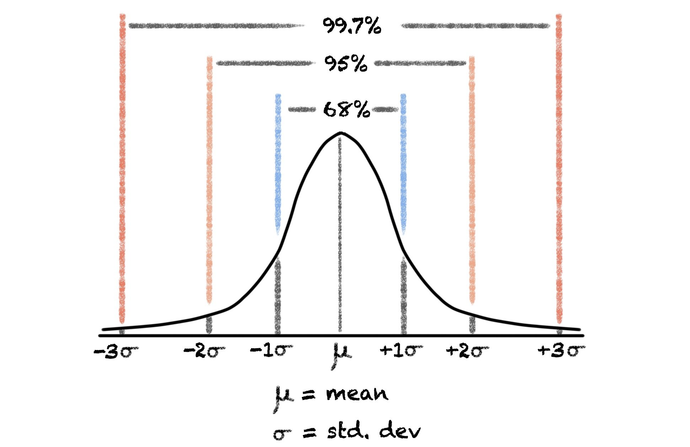
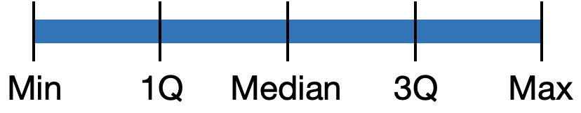
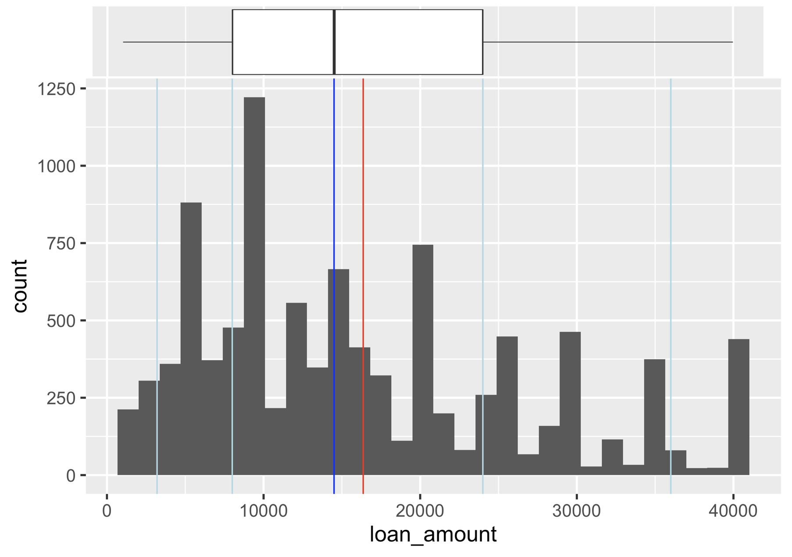

```{r, echo = FALSE, eval = FALSE}
library(renderthis)
to_pdf(from = "lecture9.html",complex_slides = TRUE)
```


```{r xaringanExtra, echo=FALSE}
xaringanExtra::use_xaringan_extra(c("tile_view", "animate_css", "tachyons"))
xaringanExtra::use_panelset()
```

```{r setup, include=FALSE}
knitr::opts_chunk$set(
  comment = "",eval = TRUE,fig.retina = 2, message=F, warning = F, fig.height = 5.5
)
```

```{r packages, echo=FALSE, message=FALSE, warning=FALSE}
library(dplyr)
library(ggplot2)
library(unvotes)
library(tidyverse)
library(openintro)
```


```{css, echo = FALSE}
.tiny .remark-code { font-size: 60%; }
.small .remark-code { font-size: 80%; }
```


```{r include = FALSE}
loans <- loans_full_schema %>%
  select(loan_amount, interest_rate, term, grade, 
         state, annual_income, homeownership, debt_to_income,
         issue_month)
```

## Reminders

- HW 2 due April 26 12pm.

- HW 3 due May 1 12pm.
  - Please start the homework as soon as possible.
  
- **Midterm 1** (Open book, take home, approximate 2 hours, time limit 5 hours) 
  - **Due April 29 midnight, cover lecture 1-12**
  - **Will not cover the Level 2 part of Homework 3**
  - Preparing guides: Finish Homework 1-3, be familiar to the lecture slides.
  - You can copy any your own codes in homework 1-3 to finish the open book exam.
  
- The PDF version of slides can be found on Canvas. 

  - You can use search on it to find function examples.

---


## Today

- Describing numerical distributions

  - Histograms
  
  - Measures of central tendency: mean, median, mode

  - Shape: skewness and modality
  
  - Spread: variance and standard deviation, range and interquartile range

  - Boxplots
    - Unusual observations
  
  - Density plot

???

Today we will learn how to describe numerical distributions using visual summaries like histograms, boxplots, and density plots. 

We will discuss measures of central tendency such as mean, median, and mode, and how to interpret the shape of a distribution in terms of skewness and modality. 

Additionally, we will learn about measures of spread such as variance, standard deviation, range, and interquartile range. 

We will explore how boxplots can help us identify unusual observations in our data.
  
---

## Data: Lending Club

- Lending Club is a platform that allows individuals to lend to other individuals

```{r}
loans <- loans_full_schema %>%
  select(loan_amount, interest_rate, term, grade, 
         state, annual_income, homeownership, debt_to_income,
         issue_month)
glimpse(loans)
```

---

## Selected variables

Variable        | Description
----------------|-------------
`loan_amount`   |	Amount of the loan received, in US dollars
`interest_rate` |	Interest rate on the loan, in an annual percentage
`term`	        | The length of the loan, which is always set as a whole number of months
`grade`	        | Loan grade, which takes a values A through G and represents the quality of the loan and its likelihood of being repaid
`state`         |	US state where the borrower resides
`annual_income` |	Borrower’s annual income, including any second income, in US dollars
`homeownership`	| Indicates whether the person owns, owns but has a mortgage, or rents
`debt_to_income` | Debt-to-income ratio
`issue_month` | Month the loan was issued

---

## Map of Describing numerical distributions

- **Visual summaries**:
  - Histogram
  - Boxplot
  - Density plot
  - Line graph 
  
- Measures of **central tendency**: mean, median, mode 

- **Shape**:
    - Skewness: right-skewed, left-skewed, symmetric 
    - Modality: unimodal, bimodal, multimodal, uniform

- **Spread**: variance and standard deviation, range and interquartile range

- **Unusual observations**

- A **summary statistic** is a single number summarizing a large amount of data

---

#### Histogram

- Shows **shape, center, and spread** of the data
- Contiguous (adjoining) boxes
  - Horizontal axis: what the data represents
  - Vertical axis: frequency or relative frequency

.tiny[
.pull-left[
```{r message = FALSE, out.width = "90%"}
ggplot(loans, aes(x = loan_amount)) +
  geom_histogram()
```
]

.pull-right[
```{r out.width = "90%"}
hist(loans_full_schema$loan_amount)
```
]
]

???

Here we introduce the histogram as a tool to show the distribution of a numerical variable. The histogram displays the shape, center, and spread of the data. The x-axis represents what the data represents, while the y-axis shows the frequency or relative frequency.

We provide two examples of the same variable, the loan amount, visualized using ggplot2's geom_histogram() function and base R's hist() function. This slide allows us to compare the different ways to create a histogram in R, using the tidyverse or base R. 

---

## Histograms and binwidth

.panelset[
.panel[.panel-name[binwidth = 1000]
```{r out.width = "50%"}
ggplot(loans, aes(x = loan_amount)) +
  geom_histogram(binwidth = 1000)
```
]
.panel[.panel-name[binwidth = 5000]
```{r out.width = "50%"}
ggplot(loans, aes(x = loan_amount)) +
  geom_histogram(binwidth = 5000)
```
]
.panel[.panel-name[binwidth = 20000]
```{r out.width = "50%"}
ggplot(loans, aes(x = loan_amount)) +
  geom_histogram(binwidth = 20000)
```
]
.panel[.panel-name[Words]
Here we shows how the binwidth parameter affects the appearance of a histogram. 

Binwidth is the width of each bin or bar in the histogram. You can easily change it inside `geom_histogram` function.

A small binwidth creates more bars that reflect more variation in the data but can also cause overplotting, making it difficult to see patterns.

A large binwidth creates fewer bars and provides a smoother visualization but may obscure some patterns.

Choosing the appropriate binwidth depends on the data and the research question.

]
]

???

Here we shows how the binwidth parameter affects the appearance of a histogram. Binwidth is the width of each bin or bar in the histogram. You can easily change it inside `geom_histogram` function.

A small binwidth creates more bars that reflect more variation in the data but can also cause overplotting, making it difficult to see patterns. A large binwidth creates fewer bars and provides a smoother visualization but may obscure some patterns. Choosing the appropriate binwidth depends on the data and the research question.

---

## Adding labels 

The labs() function can be an alternated way used to customize the labels and title of the plot.

.panelset[
.panel[.panel-name[Plot]
```{r ref.label = "hist-custom", echo = FALSE, warning = FALSE, fig.height=5}
```
]
.panel[.panel-name[Code]
```{r hist-custom, fig.show = "hide", warning = FALSE}
ggplot(loans, aes(x = loan_amount)) +
  geom_histogram(binwidth = 5000) +
  labs( #<<
    x = "Loan amount ($)", #<<
    y = "Frequency", #<<
    title = "Amounts of Lending Club loans" #<<
  ) #<<
```
]
]

???

The labs() function can be an alternated way used to customize the labels and title of the plot.

---

## Population vs. sample (2nd time, more later)
- A **sample** is a portion or **subset** of the larger **population**

- E.g., population may be UC Davis students; randomly sample 300 students on the Quad this morning

- Population **parameter**, e.g., population mean
  - This is a fixed quantity

- Sample **statistic**, e.g., sample mean
  - Depends on the sample 
  
> Use sample statistics to make **inferences** about **unknown** population parameters

???
A sample is a subset of the larger population, for example, we could take a random sample of 300 students out of the entire UC Davis student population.

We need to pay special attention to the difference between population parameter and sample statistic.

Population **parameter** is a fixed quantity, which only related to the population characteristics. 

On the other hand, sample statistic actually depends on the sample you choose from the population. Once you sample another sample from the population, the sample statistic will change accordingly.

Understanding the difference between population and sample is crucial in statistical inference. We assume we don't know what the population parameter is, and we use sample statistics to make inferences about population parameters.

---

## Measures of central tendency (R funcion)

- **Mean**: "Average", sum the numbers and divide by the count (`mean()`)
  
  $\bar{x} = \frac{x_1 + x_2 + ... + x_n}{n}$, where $x$ is the variable of interest, the subscripts index the $n$ observations, and $\bar{x}$ denotes the sample mean. 
  
  The population mean is often denoted by $\mu$.
  
- **Median**: "Middle value", arrange in ascending order (`median()`)
  
- **Mode**: Most frequent value (`mode()` does not do what you might think)

> We won't test you how to calculate them without using R.

- Note: you will sometimes need the `na.rm = TRUE` option where the data include `NA` (missing) values.

???

Here we discuss the measures of central tendency, which are used to provide a single representative value that characterizes the center of a data set. The three most commonly used measures of central tendency are mean, median, and mode. 

- **Mean**: "Average", sum the numbers and divide by the count (`mean()`)
  
  $\bar{x} = \frac{x_1 + x_2 + ... + x_n}{n}$, where $x$ is the variable of interest, the subscripts index the $n$ observations, and $\bar{x}$ denotes the sample mean. 
  
  The population mean is often denoted by $\mu$.
  
- **Median**: "Middle value", arrange in ascending order (`median()`)
  
- **Mode**: Most frequent value (`mode()` does not do what you might think)

> We won't test you how to calculate them without using R.

- Note: you will sometimes need the `na.rm = TRUE` option where the data include `NA` (missing) values.

---
## Measures of central tendency: Example

- `mean(loans$loan_amount)` = 16361.92; `median(loans$loan_amount)` = 14500

- Mode is 10000 (Exercise: how to code this in R?)

> [Solution](https://stackoverflow.com/questions/2547402/how-to-find-the-statistical-mode)

.tiny[
.pull-left[
```{r , eval = FALSE}
ggplot(loans, aes(x = loan_amount)) +
  geom_histogram() +
  geom_vline(xintercept = median(loans$loan_amount),
             col = "blue") +
  geom_vline(xintercept = mean(loans$loan_amount),
             col = "red")
```

]
]

.pull-right[
```{r , echo = FALSE, out.width = "100%"}
ggplot(loans, aes(x = loan_amount)) +
  geom_histogram() +
  geom_vline(xintercept = median(loans$loan_amount),
             col = "blue") +
  geom_vline(xintercept = mean(loans$loan_amount),
             col = "red")
```
]

???

When describing a dataset, one commonly used measure is the mean, which is the sum of all the values divided by the number of values. We can easily calculate the mean using R's mean() function. Another commonly used measure is the median, which is the value separating the higher half from the lower half of the dataset when arranged in ascending order. We can find the median using R's median() function.

We are also showing how to add lines to the histogram using geom_vline

to indicate where the mean and median fall on the distribution. 

The syntax is: xintercept = some value.

---
## Measures of shape: Skewness


```{r echo=FALSE, out.width="80%"}
knitr::include_graphics("img/skew.png")
```

- **Skewness** is the degree to which the distribution is off-centered

  - **Positive skew/right skew**: mean > median
  
  - **Negative skew/left skew**: mean < median
  
???

When describing a numerical distribution, it's important to assess the skewness of the distribution, which is a measure of whether the data are symmetric or skewed to one side. 

Skewness refers to the degree to which the distribution is off-centered, to the left or to the right, from a perfectly symmetrical distribution. 

If the mean is greater than the median, then the distribution is positively skewed, also called right-skewed. Conversely, if the mean is less than the median, then the distribution is negatively skewed, also called left-skewed.

---

## Measures of shape: Modality
- **Mode** is the most frequent value, but in real-world data sets, there might not be any observations with the same value. 

- A mode is represented by a **prominent peak in the distribution**

- **Unimodal** = one prominent peak, **bimodal** = two prominent peaks, **multimodal** = more than two prominent peaks, uniform means no peaks

```{r echo=FALSE, out.width="80%"}
knitr::include_graphics("img/modality.png")
```

???

Another measure that we can use is the mode, which is the most frequent value in a dataset. In real-world datasets, however, it is possible that there are no observations with the same value. In this case, the mode can be represented by a prominent peak in the distribution. A distribution with one prominent peak is called unimodal, two prominent peaks is bimodal, and more than two prominent peaks is multimodal. If there are no peaks, the distribution is uniform.

---
## Loans data

```{r, out.width = "70%", fig.height=4}
ggplot(loans, aes(x = loan_amount)) +
  geom_histogram(binwidth = 5000)
```

Question: What is the skewness and modality? 

---
## Measures of spread: Variance and standard deviation
- **Standard deviation** measures how far data values are from their mean

- **Deviation** is the distance of an observation from its mean, $x_i - \bar{x}$

- **Sample variance**: Take the square of deviations and find the mean, denote as $s$
  - $s^2 = \frac{(x_1 - \bar{x})^2 + (x_2 - \bar{x})^2 + ... + (x_n - \bar{x})^2}{n - 1}$
  - For the denominator, use $n-1$ instead of $n$ to make it an *unbiased estimator of the population mean*

- **Sample standard deviation**, $s = \sqrt{s^2}$

- In R, `sd()` for sample standard deviation, `var()` for sample variance

- Population variance and standard deviation are often denoted by $\sigma^2$ and $\sigma$

???

The standard deviation is used to measure how far the data values are from their mean. 

The deviation is the distance of an observation from its mean, which can be expressed as xi minus x-bar. 

The sample variance can be obtained by squaring the deviations and finding their mean.

We use n-1 as the denominator in the calculation to make it an unbiased estimator of the population mean. 

To get the sample standard deviation, we take the square root of the sample variance. 

In R, the sd() function is used to calculate the sample standard deviation, and var() is used for sample variance. 

The population variance and standard deviation are often denoted by sigma squared and sigma, respectively.

---

## Measures of spread: Example

```{r echo=FALSE, out.width="70%"}
knitr::include_graphics("img/sd.svg")
```


- **Red distribution**: concentrated closely near the mean
- **Blue distribution**: more widely spread out from the mean
- They have the same mean, skewness, modality

???

Here we show two distributions: the red one is concentrated closely near the mean while the blue one is more widely spread out from the mean. 

Despite having the same mean, skewness, and modality, these two distributions are very different.

We can use the standard deviation to quantify the amount of variability or spread in the data. The standard deviation is larger for the blue distribution and smaller for the red distribution.

---
## Measures of spread: Variance and standard deviation

- Standard deviation can roughly be interpreted as the mean distance from mean

- **Rules of thumb** for symmetric, bell-shaped distributions: 68%, 95%, and 99.7% of the values lie within one, two, and three standard deviations of the mean, respectively

```{r echo=FALSE, out.width="60%"}

```

???
Standard deviation can roughly be interpreted as the mean distance from mean

The graphic shows that 68% of the values lie within one standard deviation of the mean, 95% within two standard deviations, and 99.7% within three standard deviations. Standard deviation is a measure of how far data values are from their mean, and it can be interpreted roughly as the mean distance from the mean.

---

## Measures of spread: Range and interquartile range

```{r echo=FALSE, out.width="30%"}

```


- **Percentile**: a number that divides ordered data into hundredths
  - Median = 50th percentile 

- **Quartile**: a number that divides ordered data into quarters 
  - First quartile = 25th percentile
  - Second quartile = Median = 50th percentile
  - Third quartile = 75th percentile

- **Range** = Max - min; sensitive to outliers

- **Interquartile range** (IQR) = 3rd - 1st quartile
  - `IQR()` in R


- **Five-number summary**: Min, 1Q, Median, 3Q, Max
  - `summary()` in R (also gives mean)

???

- **Percentile**: a number that divides ordered data into hundredths
  - Median = 50th percentile 

- **Quartile**: a number that divides ordered data into quarters 
  - First quartile = 25th percentile
  - Second quartile = Median = 50th percentile
  - Third quartile = 75th percentile

We also introduce two measures of spread, Range and Interquartile Range (IQR). The Range is the difference between the maximum and minimum values in a dataset.

However, it is sensitive to outliers and does not provide information about the bulk of the data. 

The IQR is a more robust measure of spread, as it considers the middle 50% of the data, specifically the difference between the 75th percentile (third quartile) and the 25th percentile (first quartile).

The five-number summary includes the minimum value, the first quartile (Q1), the median, the third quartile (Q3), and the maximum value. summary() function in R provides a five-number summary along with the mean.

---
## Loans data
.tiny[
```{r}
sd(loans$loan_amount)
var(loans$loan_amount)
sqrt(var(loans$loan_amount))
summary(loans$loan_amount)
IQR(loans$loan_amount)
```
]


??? 

Here we use R functions to get these summary statistics of the loan_amount variable.

---

`homeownership` is a factor variable with three levels, `MORTGAGE`, `OWN` and `RENT`. How do we calculate the variance and mean for each type of home ownership status? 
--
```{r}
loans %>%
  group_by(homeownership) %>%
  summarise(var = var(loan_amount),
            mean = mean(loan_amount))
```

---

## Percentiles
Vertical lines for 5th, 25th percentile, median, mean, 75th and 95th percentiles

.panelset[
.panel[.panel-name[Plot]
```{r ref.label = "hist-percentiles", echo = FALSE, warning = FALSE}
```
]
.panel[.panel-name[Code]
```{r hist-percentiles, fig.show = "hide", warning = FALSE}
ggplot(loans, aes(x = loan_amount)) +
  geom_histogram() +
  geom_vline(xintercept = median(loans$loan_amount),
             col = "blue") +
  geom_vline(xintercept = quantile(loans$loan_amount, .05),
             col = "lightblue") +
  geom_vline(xintercept = quantile(loans$loan_amount, .25),
           col = "lightblue") + 
  geom_vline(xintercept = quantile(loans$loan_amount, .75),
           col = "lightblue") +
  geom_vline(xintercept = quantile(loans$loan_amount, .95),
           col = "lightblue") +
  geom_vline(xintercept = mean(loans$loan_amount),
             col = "red")
```
]
]

???

Here we have the  histogram of loan amounts, with vertical lines indicating different percentiles and measures of central tendency. The blue line represents the median, which is the 50th percentile of the data. The light blue lines represent the 5th, 25th, and 75th percentiles of the data. The red line represents the mean of the data.

---
## Boxplots
```{r fig.dim = c(7, 2)}
ggplot(loans, aes(x = loan_amount)) +
  geom_boxplot() +
  labs(x = "Loan amount") +
  scale_y_continuous(breaks = NULL)
```

- Lower whisker, box (1Q, median, 3Q), upper whisker
- Total length of the box is IQR
- The length of each whisker is up to 1.5*IQR
- Any points beyond that are **outliers**, observations that are unusually far from the rest of the data
- Outliers appear as points

> Boxplots are particularly useful for identifying outliers and understanding the spread of the data. 

???

Boxplots, also known as box-and-whisker plots, are a type of visualization that displays the distribution of a numerical variable. They provide a quick and effective way to visualize the five-number summary of a dataset, including the minimum and maximum values, the median, and the first and third quartiles. 

The whiskers extend from the edges of the box and represent the range of the data that falls within 1.5 times the IQR from the edge of the box. Any data points outside this range are considered outliers and represented as points.

Boxplots are particularly useful for identifying outliers and understanding the spread of the data. 

---

## Boxplots 

* Boxplot provide a concise summary of the data
```{r echo=FALSE, out.width="80%"}

```

???

Boxplots, also known as box-and-whisker plots, are a type of visualization that displays the distribution of a numerical variable. They provide a quick and effective way to visualize the five-number summary of a dataset, including the minimum and maximum values, the median, and the first and third quartiles. Boxplots are particularly useful for identifying outliers and understanding the spread of the data. 

From this picture we know how Boxplot provide a concise summary of the data

---

## Box plot and outliers

Income data are often skewed (right or left?)

```{r fig.dim = c(7, 2)}
ggplot(loans, aes(x = annual_income)) +
  geom_boxplot()+
  scale_y_continuous(breaks = NULL)
```

???

Here is the example of outliers in the boxplot of income.

---
## Boxplots in base R
.tiny[
.pull-left[
```{r message = TRUE, out.width = "100%"}
ggplot(loans, aes(x = loan_amount)) +
  geom_boxplot()
```
]

.pull-right[
```{r out.width = "100%"}
boxplot(loans$loan_amount)
```
]
]

???

Here we compare boxplot in base R and in ggplot2 package.

---

## Another way to remove y-axis labels

We saw `scale_y_continuous(breaks = NULL)` earlier

.panelset[
.panel[.panel-name[Plot]
```{r ref.label = "box-custom", echo = FALSE, warning = FALSE}
```
]
.panel[.panel-name[Code]
```{r box-custom, fig.show = "hide", warning = FALSE}
ggplot(loans, aes(x = loan_amount)) +
  geom_boxplot() +
  labs(
    x = "Loan amount ($)",
    y = NULL,
    title = "Loan amounts of Lending Club loans"
  ) +
  theme( #<<
    axis.ticks.y = element_blank(), #<<
    axis.text.y = element_blank() #<<
  ) #<<
```
]
]

---

## Density plot

Density plots are an alternative to histograms 

.tiny[
.pull-left[
```{r message = TRUE, out.width = "100%"}
ggplot(loans, aes(x = loan_amount)) +
  geom_density()
```
]

.pull-right[
```{r out.width = "100%"}
plot(density(loans$loan_amount))
```
]
]

???

Density plots are another way of visualizing distributions of data. They are similar to histograms but instead of using bars, they use a smooth curve to represent the distribution of the data. Density plots can be particularly useful for showing the shape of a distribution, especially when there are multiple modes or when the distribution is not symmetric. In a density plot, the y-axis represents the density or relative frequency of observations at a given point on the x-axis, which represents the range of values of the variable being plotted. Density plots are often used in combination with histograms and box plots to provide a more complete picture of the distribution of data.

---

## Density plots and adjusting bandwidth

* Larger adjust = smoother

.panelset[
.panel[.panel-name[adjust = 0.5]
```{r out.width = "50%"}
ggplot(loans, aes(x = loan_amount)) +
  geom_density(adjust = 0.5)
```
]
.panel[.panel-name[adjust = 1]
```{r out.width = "50%"}
ggplot(loans, aes(x = loan_amount)) +
  geom_density(adjust = 1) # default bandwidth
```
]
.panel[.panel-name[adjust = 2]
```{r out.width = "50%"}
ggplot(loans, aes(x = loan_amount)) +
  geom_density(adjust = 2)
```
]
]

???
One important aspect of density plots is the bandwidth, which determines the width of the kernel used to estimate the density. A larger bandwidth results in a smoother curve and a smaller bandwidth produces a more detailed curve. The choice of bandwidth can affect the shape and interpretation of the density plot, so it is important to choose an appropriate value based on the characteristics of the data. In R, you can adjust the bandwidth by using functions like ggplot() that have a built-in bandwidth adjustment mechanism.

---

## Title and labels 

.panelset[
.panel[.panel-name[Plot]
```{r ref.label = "density-custom", echo = FALSE, warning = FALSE}
```
]
.panel[.panel-name[Code]
```{r density-custom, fig.show = "hide", warning = FALSE}
ggplot(loans, aes(x = loan_amount)) +
  geom_density(adjust = 2) +
  labs( #<<
    x = "Loan amount ($)", #<<
    y = "Density", #<<
    title = "Amounts of Lending Club loans" #<<
  ) #<<
```
]
]


---

## Next lecture: Relationships between numerical variables

- Paired or bivariate data

  - Scatterplot 

  - Hexplot

  - Correlation
  
  - Line graph 

---

## Summary

--

- Describing numerical distributions

  - Histograms
  
  - Measures of central tendency: mean, median, mode

  - Shape: skewness and modality
  
  - Spread: variance and standard deviation, range and interquartile range

  - Boxplots
    - Unusual observations
  
  - Density plot
 

